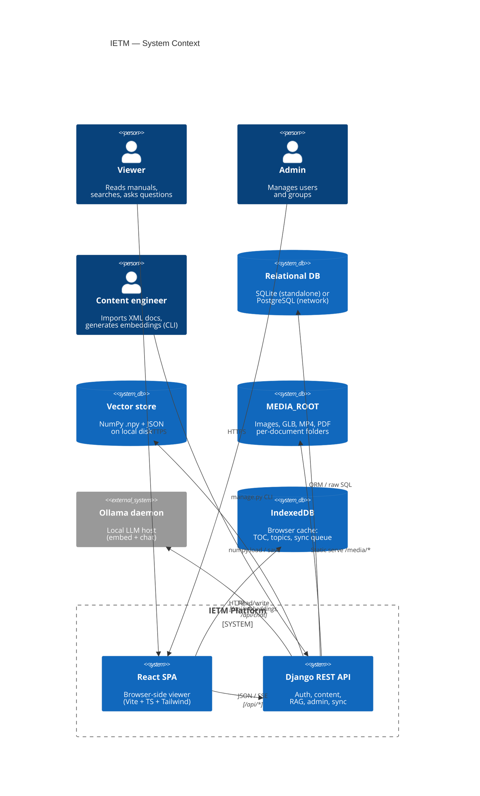
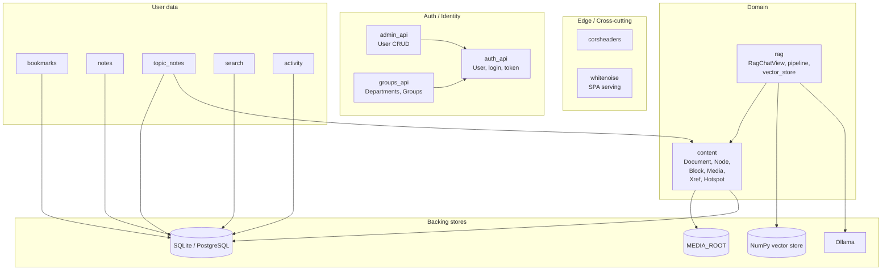
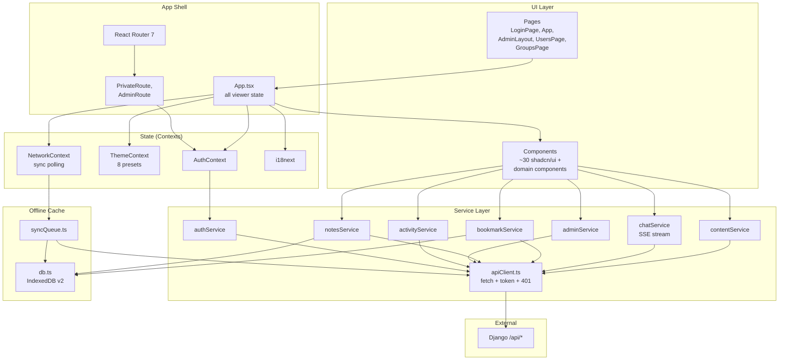
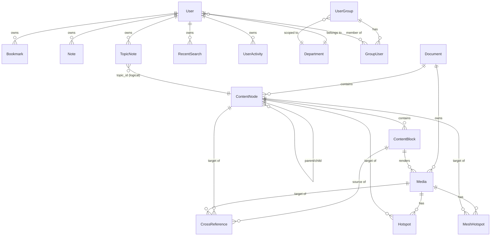
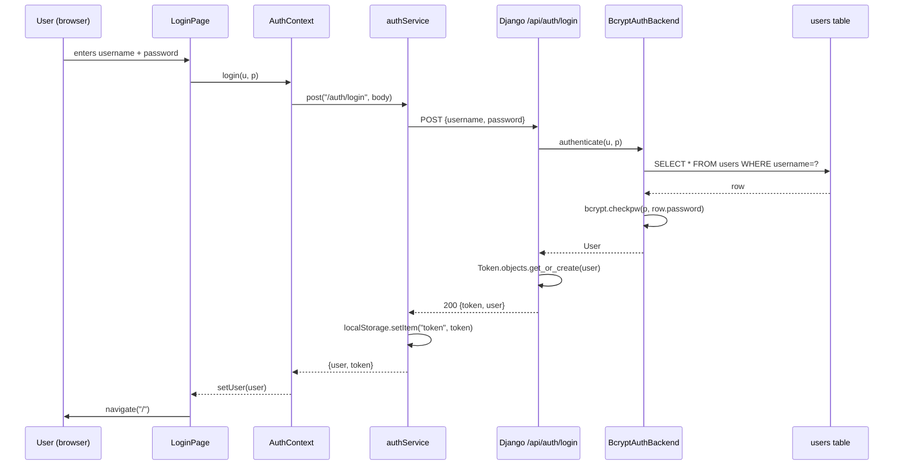
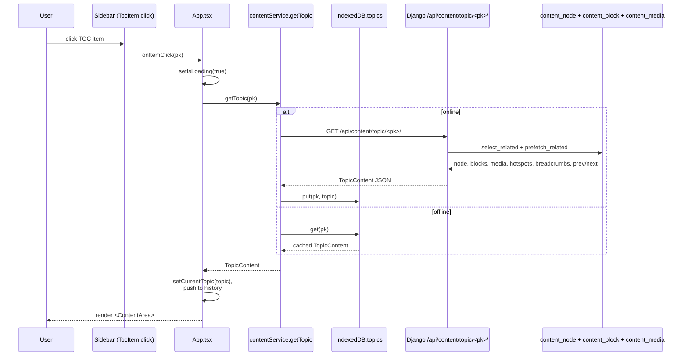
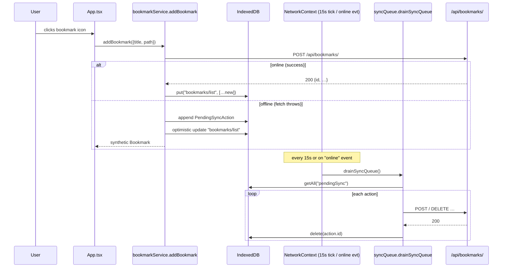
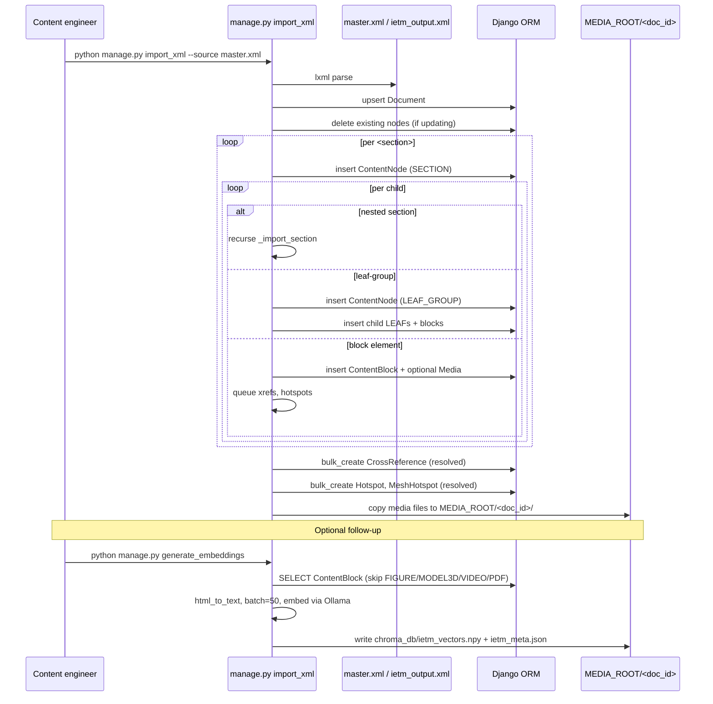
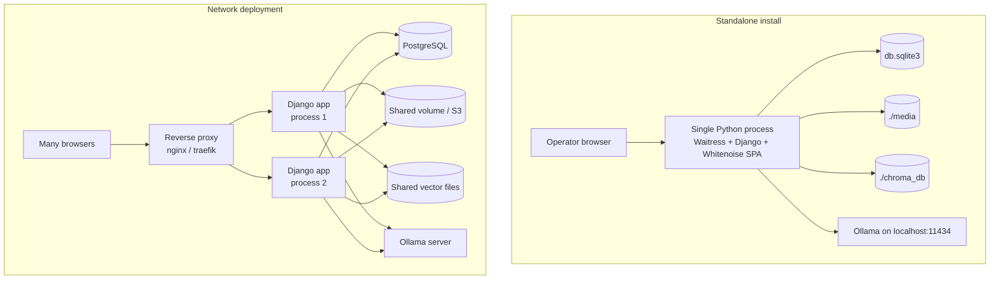

# High-Level Design — IETM (Interactive Electronic Technical Manual)

> **Audience:** new engineers, architects, security reviewers, ops.
> **Companion doc:** [LLD.md](./LLD.md) — per-function, per-model, per-endpoint detail.
> **Version of code documented:** repo state as of initial commit `015e2da`.

---

## 1. Executive Summary

**IETM** is a full-stack web application for reading and querying structured technical documentation for Indian defence equipment. A single ingested XML "master" document is exploded into a normalised tree of sections, blocks, and media; users browse the tree, full-text search, click cross-references, view embedded figures, tables, videos, PDFs and interactive 3D models, and ask natural-language questions answered by a local LLM grounded in the document corpus (RAG).

**Primary users**

| Persona | Capabilities |
|---|---|
| **Viewer** (technician/operator) | Browse TOC, read topics, search, follow xrefs, view media, ask RAG questions, bookmark, take notes, work offline |
| **Admin** | Everything above + manage users, departments, and access groups |
| **Content engineer** (CLI) | Run `manage.py import_xml` to ingest new documents and `manage.py generate_embeddings` to index them for RAG |

**Headline capabilities**

- Hierarchical TOC with materialised path for fast tree queries
- Multi-mode search: text, figure, component, headings
- Cross-reference resolution between sections, figures, and tables
- Embedded 3D GLTF models with click-to-navigate mesh hotspots
- 2D image hotspots with percentage-based coordinates
- Streaming RAG chat (SSE) grounded on the ingested corpus via Ollama
- Offline-first frontend backed by IndexedDB + replay queue
- Eight themable colour presets and English/Hindi i18n
- Two deployment modes: **standalone** (single-host SQLite) and **network** (PostgreSQL)

---

## 2. System Context



**External dependencies**

| Dependency | Purpose | Failure mode |
|---|---|---|
| **Ollama** (`http://localhost:11434`) | Embeddings (`nomic-embed-text`) + chat (`llama3.2`) | RAG chat returns `{type:"error"}` SSE frame; rest of app unaffected |
| **Filesystem (MEDIA_ROOT)** | Serves all images, GLB models, videos, PDFs | 404s on individual assets |
| **Vector store on disk** (`chroma_db/ietm_vectors.npy` + `ietm_meta.json`) | Cosine-similarity search for RAG | If missing, RAG search returns empty → LLM refuses politely |

---

## 3. Logical Architecture

### 3.1 Backend — Django apps and dependencies



### 3.2 Frontend — layered architecture



### 3.3 Deployment modes

The same Django process supports two distinct deployment shapes selected by environment variables, evaluated at startup:

| Variable | Values | Effect |
|---|---|---|
| `IETM_MODE` | `standalone` (default) / `network` | Switches DB engine: SQLite vs PostgreSQL |
| `SERVE_SPA` | unset / `1` | When `1`, inserts WhiteNoise middleware and adds a catch-all URL pattern that serves the built React SPA from `STATIC_ROOT/frontend/`. URLs not starting with `api/`, `static/`, `media/`, or `admin/` are routed to the React `index.html` |
| `IETM_DB_PATH` / `IETM_MEDIA_ROOT` / `IETM_STATIC_ROOT` | absolute path | Override default `BASE_DIR`-relative locations (useful for read-only app dirs + writable data volumes) |

| Mode | DB | Static/SPA | Use case |
|---|---|---|---|
| Standalone | SQLite (`db.sqlite3`) | WhiteNoise can serve SPA from same process | Single-host install on an air-gapped workstation |
| Network | PostgreSQL | SPA typically served by separate web server | Multi-user LAN or datacentre |

---

## 4. Technology Stack Summary

### 4.1 Backend (`backend/requirements.txt`)

| Package | Version | Role |
|---|---|---|
| `Django` | 4.2.9 | Web framework |
| `djangorestframework` | 3.14.0 | REST API toolkit |
| `django-cors-headers` | 4.3.1 | CORS middleware |
| `django-crispy-forms` | 2.5 | Form rendering (admin templates) |
| `psycopg2-binary` | 2.9.9 | PostgreSQL driver (network mode) |
| `whitenoise` | 6.8.2 | Static file serving (SPA mode) |
| `waitress` | 3.0.1 | Pure-Python WSGI server |
| `bcrypt` | 4.1.2 | Custom password hashing (12 rounds) |
| `lxml` | 5.3.0 | XML parsing in ingestion command |
| `beautifulsoup4` | 4.12.3 | HTML → text for RAG embeddings |
| `httpx` | 0.27.2 | HTTP client to Ollama (streaming) |
| `numpy` | (latest) | Vector store math (cosine similarity) |
| `python-dotenv` | 1.0.0 | `.env` loading |

### 4.2 Frontend (`frontend/package.json`)

| Concern | Library | Version |
|---|---|---|
| Build | Vite + `@vitejs/plugin-react` | 6.3.5 / 4.7.0 |
| Language | TypeScript | ^6.0.3 |
| UI runtime | React + ReactDOM | 18.3.1 |
| Routing | `react-router` | 7.13.0 |
| Styling | TailwindCSS + `tailwind-merge` + CVA | 4.1.12 / 3.2.0 / 0.7.1 |
| UI primitives | shadcn/ui (Radix) | various |
| Optional MUI | `@mui/material` + icons | 7.3.5 |
| Animation | `motion` (Framer) | 12.23.24 |
| 3D | `@react-three/fiber` + `drei` + `three` | 8.17.10 / 9.120.4 / 0.170.0 |
| Offline | `idb` | 8.0.3 |
| i18n | `i18next` + `react-i18next` | ^26.0.3 / ^17.0.2 |
| Markdown | `react-markdown` + `remark-gfm` | ^10.1.0 / ^4.0.1 |
| Toasts | `sonner` | 2.0.3 |
| Icons | `lucide-react` | 0.487.0 |
| PWA | `vite-plugin-pwa` | 0.21.1 |

---

## 5. Domain Model (HLD level)

### 5.1 Core entity-relationship diagram



### 5.2 The `SECTION / LEAF_GROUP / LEAF` pattern

Every `ContentNode` has one of three types, capturing how IETM XML structures content:

| `node_type` | Role | Has its own `ContentBlock`s? | Navigable? |
|---|---|---|---|
| `SECTION` | A numbered chapter / section / subsection. May contain other sections, leaf-groups, and blocks. | Yes | Yes (if `hasContent`) |
| `LEAF_GROUP` | Container under a `SECTION` whose `LEAF` children should be rendered together as a single topic page | No | Yes — always (its leaves render inline) |
| `LEAF` | An individual sub-item under a `LEAF_GROUP`. Owns blocks but is **not directly navigable** in the web UI — the frontend resolves a `LEAF` click to its parent `LEAF_GROUP`. | Yes | No (redirected) |

This is enforced by `content_topic` (`backend/content/api_views.py`) which redirects LEAF requests to the parent, and `content_tree` which excludes LEAF nodes from the sidebar.

### 5.3 Materialised path

`ContentNode.path` stores a dotted string like `"1.2.3"`. Combined with the default `ordering = ["path"]`, this gives lexicographic = document-order traversal **without recursion**, and allows prefix `LIKE` queries for sub-trees if needed in the future.

---

## 6. Key End-to-End Flows

### 6.1 Login + token issuance



### 6.2 Topic load (with cache)



### 6.3 RAG chat streaming

```mermaid
sequenceDiagram
    participant U as User
    participant CP as ChatPanel
    participant CS as chatService.streamChat
    participant API as Django RagChatView
    participant P as rag.pipeline.rag_stream
    participant E as embeddings.get_embedding
    participant V as vector_store.similarity_search
    participant O as Ollama

    U->>CP: types question, hits Send
    CP->>CS: streamChat({query, doc_pk, history})
    CS->>API: POST /api/rag/chat/ (Token auth)
    API->>P: rag_stream(query, history, doc_pk)
    P->>E: get_embedding(query)
    E->>O: POST /api/embeddings (nomic-embed-text)
    O-->>E: [float;768]
    E-->>P: embedding
    P->>V: similarity_search(emb, top_k=4, doc_pk)
    V->>V: normalize + dot product
    V-->>P: top-k hits (chroma_id, distance, metadata)
    P->>P: _assemble_context (dedup, distance<0.45, truncate)
    P-->>API: yield {type:"sources", sources:[…]}
    API-->>CS: SSE: data: {…sources…}
    CS->>CP: onEvent({sources})
    P->>O: POST /api/chat (llama3.2, stream=true)
    loop tokens
        O-->>P: chunk
        P-->>API: yield {type:"token", content}
        API-->>CS: SSE: data: {…token…}
        CS->>CP: onEvent({token})
    end
    P-->>API: yield {type:"done"}
    API-->>CS: SSE: data: {"type":"done"}
    CS->>CP: onDone
```

### 6.4 Offline bookmark + later sync



### 6.5 XML ingestion (offline CLI)



---

## 7. Cross-Cutting Concerns

### 7.1 Authentication & authorisation matrix (HLD overview)

The backend exposes ~30 endpoints. Full per-endpoint matrix is in [LLD.md §A.14](./LLD.md#a14-database-schema--authnauthz-matrix); the summary buckets:

| Bucket | Permission | Endpoints |
|---|---|---|
| Public | `AllowAny` | health, dbtest, login, register, print logs, model/image hotspot legacy endpoints, **notes (some methods)**, **search**, **activity** ⚠️ |
| Authenticated | `IsAuthenticated` | bookmarks, topic-notes, content/*, rag/chat, protected |
| Admin only | `IsAdminRole` | admin/*, groups/*, departments |

⚠️ Notes/search/activity endpoints accepting `AllowAny` accept arbitrary `userId` in the body — a privacy/integrity gap flagged in §9 and the LLD hardening section.

### 7.2 Theming & i18n

- Theme: 8 named CSS-variable presets stored in `ThemeContext`, applied to `document.documentElement.style`, persisted in `localStorage["ietm-theme"]`. All shell components reference variables like `var(--ietm-header-bg)` inline so any preset propagates instantly.
- i18n: `i18next` with `en`/`hi` JSON bundles, toggled in `TopBar`, persisted in `localStorage["language"]`. All user-facing strings flow through `useTranslation()`.

### 7.3 Offline-first

- IndexedDB schema `ietm-offline` v2 with 6 stores (`toc`, `topics`, `bookmarks`, `notes`, `pendingSync`, `xrefCache`).
- Reads: every `contentService` method writes-through into IndexedDB and reads back when fetch fails.
- Writes: bookmark + note mutations enqueue `PendingSyncAction` on failure; `syncQueue.drainSyncQueue()` replays them.
- Triggers for drain: `window.online` event, `document.visibilitychange`, and a 15-second polling tick in `NetworkProvider`.
- **Known caveat (HLD-level):** `NetworkContext.isOnline` is currently hardcoded to `true`. The offline banner never appears. The drain logic still runs correctly because fetches simply fail when offline.

### 7.4 Error handling pattern

- **Frontend:** `apiClient` throws `ApiError` on non-2xx; service methods either catch + fall back to IndexedDB (writes), or let it bubble up to component-level try/catch with `sonner` toast.
- **Backend:** Views catch broad `Exception` and return a 500 JSON envelope. Authentication failures return 401; permission failures return 403. RAG errors are emitted as in-stream SSE `{type:"error"}` frames.

### 7.5 Logging gaps

There is **no structured logging** today — backend relies on Django's default console logger; the frontend doesn't ship to any aggregator. Recommended action in §9.

---

## 8. Operational View

### 8.1 Topology



### 8.2 Runtime processes

| Process | Required? | Notes |
|---|---|---|
| **Django WSGI** (Waitress in standalone; Gunicorn/uWSGI in prod) | Yes | One process per host today; safe to horizontally scale once shared storage is set up |
| **Ollama daemon** | Only for RAG | RAG endpoint degrades gracefully if absent |
| **Static file server** | If `SERVE_SPA=1` | WhiteNoise in-process; otherwise a reverse-proxy serves `frontend/dist/` |
| **PostgreSQL** | Network mode only | |

### 8.3 Backup & state

| Asset | Today | Risk |
|---|---|---|
| `db.sqlite3` | Manual file copy (`db.sqlite3.bak_before_test` exists) | No scheduled backup |
| `chroma_db/*.npy + *.json` | None | Trivially regenerable from DB via `generate_embeddings`, but takes minutes |
| `media/` | None | Lost media = broken figures; can be re-copied from source XML import directory |
| `.env` | In repo? (check `.gitignore`) | Must be excluded; secret rotation needed |

---

## 9. Production Hardening Recommendations (HLD level)

Items below are the **critical few** that should be addressed before going beyond a controlled-LAN pilot. Concrete file-level guidance is in [LLD.md §C.3](./LLD.md#c3-production-hardening-lld-level-concrete-actions).

### 9.1 Security

| # | Issue | Risk |
|---|---|---|
| 1 | `CORS_ALLOW_ALL_ORIGINS = True` and `CORS_ALLOW_CREDENTIALS = True` | Any origin can call the API with the user's session cookie → CSRF/data theft |
| 2 | Notes, Search, Activity endpoints use `AllowAny` and accept arbitrary `userId` in the body | Any actor can read or write any user's notes / search history / activity log |
| 3 | Token stored in `localStorage` (`token`) | XSS in the SPA can exfiltrate the token and impersonate the user indefinitely (token has no expiry today) |
| 4 | `CSRF_COOKIE_HTTPONLY = False` | Compounds (3) — XSS can also read the CSRF cookie |
| 5 | No rate-limiting on `/api/auth/login` or `/api/rag/chat/` | Credential brute force and RAG cost amplification |
| 6 | `AUTH_PASSWORD_VALIDATORS = []` | Users can pick `"a"` as a password |
| 7 | `DEBUG = True` default; `ALLOWED_HOSTS = '*'` default | Information disclosure if deployed without overriding `.env` |
| 8 | No MFA / no SSO | Single shared password is the only factor |
| 9 | `_global` assets (prepages, abbreviations) served to any authenticated user without department/classification gating | Mismatched access controls against `classification = SECRET` documents |
| 10 | RAG has no prompt-injection defence | Hostile content in an ingested document could derail responses |

### 9.2 Reliability & scaling

- The custom NumPy vector store loads everything into memory on every search. Replace with a real vector DB (Chroma client, PGVector, Qdrant) once the corpus exceeds ~10k blocks.
- `import_xml` and `generate_embeddings` run synchronously in the operator's shell; both should be wrapped in a job runner (Celery/RQ) so the admin UI can trigger and monitor them.
- Add a deep health check (`/api/health-deep`) that verifies DB, vector files, and Ollama reachability.

### 9.3 Observability

- Adopt structured JSON logging (`django-structlog`); send to Loki / Elasticsearch.
- Add Sentry SDK on both ends.
- Export Prometheus metrics: request latency, RAG E2E latency, vector-search latency, IndexedDB error rate (via frontend metric beacon).

### 9.4 Performance

- Add long-lived `Cache-Control` headers to `/media/` (assets are immutable per import).
- Pre-compute the prev/next ordering used by `content_topic` at ingest time and store on `ContentNode` — it currently re-walks the whole document on every topic load.
- Index `recent_searches.user_id` and `user_activity.user_id` (both missing today; tables are unmanaged).
- Adopt React Query (or similar) on the frontend so the TOC and topic fetches dedupe across components.

### 9.5 CI/CD & DevX

- No tests, no linter config, no CI pipeline today.
- Add `pytest` + `pytest-django` + factory-boy for backend, Vitest + Testing Library for frontend.
- Add pre-commit: ruff + black + mypy + eslint + prettier.
- Add `docker-compose.yml` with `web`, `db`, `ollama` services for a one-command dev environment.
- Add GitHub Actions: lint → typecheck → test → build container → push.

### 9.6 Secrets & config

- Confirm `.env` is in `.gitignore`.
- Rotate any `SECRET_KEY` that may have been committed.
- Move secrets to a vault (AWS Secrets Manager / HashiCorp Vault / sealed-secrets) for production.

---

## 10. Glossary

| Term | Meaning |
|---|---|
| **IETM** | Interactive Electronic Technical Manual — the document genre this platform serves |
| **TOC** | Table of Contents (left sidebar tree) |
| **xref** | XML cross-reference (`<xref target="…">`) — rendered as clickable link |
| **LEAF_GROUP / LEAF** | See §5.2 — XML structural pattern for grouped sub-items |
| **CALS table** | A specific XML table model with `<tgroup>/<row>/<entry>` and `morerows`/`namest`/`nameend` for spans |
| **Hotspot** | 2D rectangle on an image that, when clicked, navigates to a target node |
| **Mesh hotspot** | A named mesh inside a GLB model that fires the same kind of navigation |
| **SSE** | Server-Sent Events — the HTTP streaming format used for RAG chat |
| **RAG** | Retrieval-Augmented Generation — embed query, find similar document chunks, ground LLM answer in them |
| **Prepages** | The "front matter" PDF/HTML displayed in a modal (cover, foreword, etc.) |
| **Materialised path** | Storing the full ancestor path as a string column (e.g. `"1.2.3"`) so tree queries become string queries |
