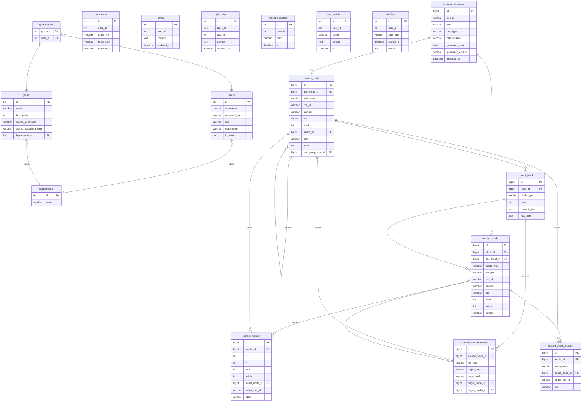
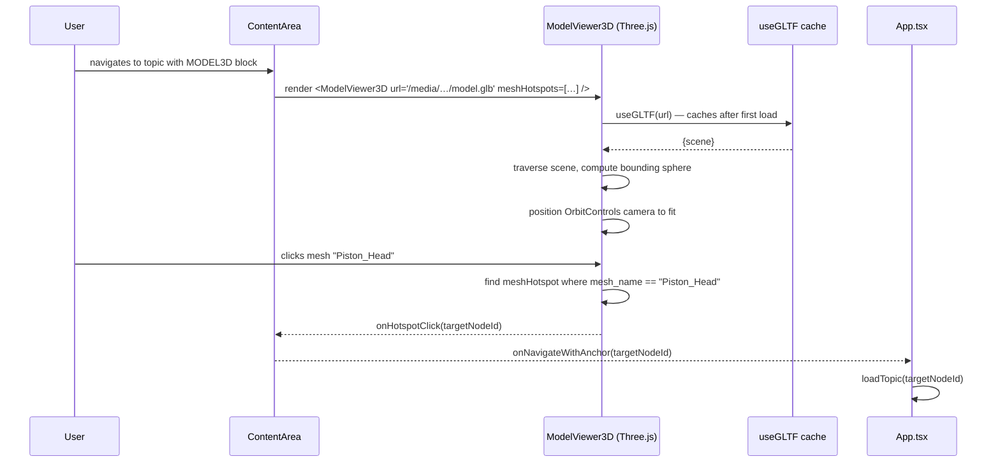

# Low-Level Design — IETM (Interactive Electronic Technical Manual)

> **Audience:** engineers writing code, reviewing PRs, debugging, or hardening this system.
> **Companion doc:** [HLD.md](./HLD.md) — system context, architecture diagrams, flows, hardening overview.
> **Depth:** per-function, per-model, per-endpoint. Every field, every method, every URL pattern.

---

## Part A — Backend LLD

---

### A.1 Project Configuration

**File:** `backend/ietm_backend/settings.py`

#### Database

```python
IETM_MODE = os.getenv('IETM_MODE', 'standalone')
```
- `'standalone'` → SQLite at `BASE_DIR/db.sqlite3` (or `IETM_DB_PATH` override); timeout=20s
- `'network'`    → PostgreSQL using `DB_NAME`, `DB_USER`, `DB_PASSWORD`, `DB_HOST`, `DB_PORT`

#### Installed apps (order matters for migrations)

```
django.contrib.contenttypes   – Content-type framework (needed by admin + permissions)
django.contrib.sessions       – DB-backed session engine
django.contrib.staticfiles    – collectstatic
rest_framework                – DRF API framework
rest_framework.authtoken      – Token model + auth class
django.contrib.auth           – Default auth (referenced by custom User via AbstractBaseUser)
corsheaders                   – CORS middleware
auth_api                      – Custom User model
bookmarks, notes, search, activity
admin_api, groups_api, topic_notes
content                       – Core document domain
rag                           – RAG pipeline + embeddings
```

#### Middleware (top to bottom, request order)

| Position | Middleware | Purpose |
|---|---|---|
| 1 | `CorsMiddleware` | Must be first; adds CORS headers |
| 2 | `SecurityMiddleware` | HSTS, XSS, content-type sniffing |
| 3 | `WhiteNoiseMiddleware` | Inserted here only when `SERVE_SPA=1` |
| 4 | `SessionMiddleware` | Enables `request.session` |
| 5 | `CommonMiddleware` | Trailing-slash redirect etc. |
| 6 | `CsrfViewMiddleware` | CSRF token validation |
| 7 | `AuthenticationMiddleware` | Populates `request.user` via session |
| 8 | `XFrameOptionsMiddleware` | Sets `X-Frame-Options: SAMEORIGIN` |

#### REST framework

```python
DEFAULT_AUTHENTICATION_CLASSES: [TokenAuthentication, SessionAuthentication]
DEFAULT_PERMISSION_CLASSES:     [IsAuthenticated]  # override per-view as needed
```

#### CORS (⚠ insecure for production)

```python
CORS_ALLOW_ALL_ORIGINS  = True   # any origin may call the API
CORS_ALLOW_CREDENTIALS  = True   # includes cookies in cross-origin requests
```

#### Session

```python
SESSION_ENGINE         = 'django.contrib.sessions.backends.db'
SESSION_COOKIE_HTTPONLY = True   # JS cannot read session cookie
SESSION_COOKIE_SAMESITE = 'Lax'
SESSION_COOKIE_AGE     = 28800   # 8 hours
```

#### CSRF (⚠)

```python
CSRF_COOKIE_HTTPONLY = False  # JS CAN read the CSRF cookie — XSS can steal it
CSRF_COOKIE_SAMESITE = 'Lax'
```

#### RAG settings

```python
OLLAMA_BASE_URL       = os.environ.get("OLLAMA_BASE_URL",    "http://localhost:11434")
OLLAMA_EMBED_MODEL    = os.environ.get("OLLAMA_EMBED_MODEL", "nomic-embed-text")
OLLAMA_CHAT_MODEL     = os.environ.get("OLLAMA_CHAT_MODEL",  "llama3.2")
CHROMA_PERSIST_DIR    = os.environ.get("CHROMA_PERSIST_DIR", str(BASE_DIR / "chroma_db"))
RAG_TOP_K             = int(os.environ.get("RAG_TOP_K",             "4"))
RAG_MAX_CONTEXT_CHARS = int(os.environ.get("RAG_MAX_CONTEXT_CHARS", "4000"))
```

#### Static / media

```python
STATIC_URL    = 'static/'
STATIC_ROOT   = BASE_DIR / 'staticfiles'   # or IETM_STATIC_ROOT
MEDIA_URL     = '/media/'
MEDIA_ROOT    = BASE_DIR / 'media'         # or IETM_MEDIA_ROOT
```

When `SERVE_SPA=1`, `WHITENOISE_ROOT` is set to `STATIC_ROOT/frontend/` if that directory exists, letting WhiteNoise serve the built React app.

Other notable defaults:

```
AUTH_PASSWORD_VALIDATORS = []   # ⚠ no password strength enforcement
ALLOWED_HOSTS = '*'             # ⚠ must be restricted in production
DEBUG = True                    # ⚠ default — always override in production
SECRET_KEY = os.getenv('SECRET_KEY', '...-insecure-fallback...')
```

---

### A.2 Top-level URL routing

**File:** `backend/ietm_backend/urls.py`

#### Mode A — `SERVE_SPA=1` (API-only + catch-all SPA)

```
/health                                 → views.health
/dbtest                                 → views.dbtest
/protected                              → views.protected
/api/content/                           → content.api_urls
/api/auth/                              → auth_api.urls
/api/bookmarks/                         → bookmarks.urls
/api/notes/                             → notes.urls
/api/topic-notes/                       → topic_notes.urls
/api/search/                            → search.urls
/api/activity/                          → activity.urls
/api/admin/                             → admin_api.urls
/api/groups/                            → groups_api.urls
/api/departments                        → groups_api.urls_dept
/api/rag/                               → rag.urls
/api/printLogs                          → views.print_logs
/api/model-hotspots/<str:modelName>     → views.model_hotspots
/api/image-hotspots/<str:imageName>     → views.image_hotspots
/media/<path>                           → django.conf.urls.static
^(?!api/|static/|media/|admin/).*$      → serve_spa.serve_react  (React index.html)
```

#### Mode B — `SERVE_SPA` unset (hybrid template + API)

All API patterns above **plus**:

```
/                          → content.urls  (Django template viewer)
/admin-panel/              → content.admin_urls
```

The template viewer at `/` serves the same documentation in server-rendered HTML — a legacy mode that co-exists with the SPA.

---

### A.3 `auth_api` app

**Files:** `backend/auth_api/models.py`, `backends.py`, `utils.py`, `permissions.py`, `views.py`, `urls.py`

#### Model: `User` (custom `AbstractBaseUser`)

```
Table: users   managed: False (pre-existing schema, no migrations)

Field            Type                       Constraints / Notes
──────────────────────────────────────────────────────────────────
id               AutoField                  PK
username         CharField(255)             UNIQUE
password         CharField(255)             db_column='password_hash'; bcrypt hash
role             CharField                  default='viewer'; values: 'admin'|'viewer'
department       CharField(null, blank)     Free-text department name
is_active        BooleanField               default=True
last_login       (disabled)                 AbstractBaseUser default removed
```

`UserManager.create_user(username, password, **extra)`:
- calls `hash_password(password)` from `utils.py`
- saves and returns user

`UserManager.create_superuser(username, password, **extra)`:
- sets `role='admin'`

#### Authentication backend: `BcryptAuthBackend`

`authenticate(request, username, password) → User | None`:
1. `User.objects.get(username=username)` — returns `None` on `DoesNotExist`
2. `bcrypt.checkpw(password.encode('utf-8'), user.password.encode('utf-8'))`
3. Returns `user` on match, `None` otherwise

`get_user(user_id) → User | None`:
- `User.objects.get(pk=user_id)` — returns `None` on `DoesNotExist`

#### `utils.py`

`hash_password(plain: str) → str`:
- `salt = bcrypt.gensalt(rounds=12)`
- `return bcrypt.hashpw(plain.encode(), salt).decode()`

`verify_password(plain: str, hashed: str) → bool`:
- `return bcrypt.checkpw(plain.encode(), hashed.encode())`

#### `permissions.py`

`IsAdminRole(BasePermission).has_permission(request, view)`:
- Returns `True` iff `request.user.is_authenticated and request.user.role == 'admin'`

#### Views

**`login(request)` — `POST /api/auth/login/`**
- Permission: `AllowAny`
- Reads: `request.data['username']`, `request.data['password']`
- Calls: `authenticate(request, username, password)` → `BcryptAuthBackend`
- On success: `django_login(request, user)`, `Token.objects.get_or_create(user=user)`, return `200 {"token": t, "user": {id, username, role, department}}`
- On failure: return `401 {"error": "Invalid credentials"}`

**`register(request)` — `POST /api/auth/register/`**
- Permission: `AllowAny`
- Creates `User(username=..., password=hash_password(pwd), role='viewer')`
- Returns `201 {"token": t, "user": {...}}`

**`logout(request)` — `POST /api/auth/logout/`**
- Permission: `IsAuthenticated`
- Deletes `Token.objects.filter(user=request.user)`
- Calls `django_logout(request)`
- Returns `200 {"message": "Logged out"}`

#### URLs

```
POST /api/auth/login/     → login
POST /api/auth/register/  → register
POST /api/auth/logout/    → logout
```

---

### A.4 `admin_api` app

**Files:** `backend/admin_api/views.py`, `urls.py`

All endpoints require `IsAdminRole`.

#### `users_list(request)` — `GET /api/admin/users`

Query param: `?search=<substr>` (optional; substring match on `username`)
- `User.objects.all()` — optionally filtered with `username__icontains`
- Returns: `[{id, username, role, department, is_active}, …]`

#### `users_list(request)` — `POST /api/admin/users`

Body: `{username, password, role="viewer", department="", is_active=True}`
- `User.objects.create(username, hash_password(password), role, department, is_active)`
- Returns: `201 {success:true, userId}`
- Raises: `IntegrityError` → `400 {error: "Username already exists"}`

#### `user_detail(request, id)` — `GET /api/admin/users/<id>`

- `User.objects.get(pk=id)` — 404 if missing
- Returns: `{id, username, role, department, is_active}`

#### `user_detail(request, id)` — `PUT /api/admin/users/<id>`

Body (all fields optional): `{username?, role?, department?, is_active?, password?}`
- Fetches user, updates only provided fields; if `password` present, calls `hash_password`
- `user.save()`
- Returns: `{success:true, updatedId}`

#### `user_detail(request, id)` — `DELETE /api/admin/users/<id>`

- `User.objects.filter(pk=id).delete()`
- Returns: `{success:true}`

#### `user_status(request, id)` — `PUT /api/admin/users/<id>/status`

Body: `{is_active: bool}`
- Updates `user.is_active`, saves
- Returns: `{success:true}`

#### URLs

```
GET POST /api/admin/users            → users_list
GET PUT DELETE /api/admin/users/<id> → user_detail
PUT /api/admin/users/<id>/status     → user_status
```

---

### A.5 `groups_api` app

**Files:** `backend/groups_api/models.py`, `views.py`, `urls.py`, `urls_dept.py`

#### Models (all `managed=False`, raw SQL schema)

**`Department`** — table `departments`

```
id   AutoField  PK
name CharField(255)
```

**`UserGroup`** — table `groups`

```
id                  AutoField  PK
name                CharField(255)
description         TextField(null, blank)
shared_username     CharField(null, blank)
shared_password_hash CharField(null, blank)
department_id       FK → Department (SET_NULL, null, blank)
```

**`GroupUser`** — table `group_users` (junction)

```
group_id  FK → UserGroup (CASCADE)
user_id   FK → User (CASCADE)
unique_together: (group_id, user_id)
```

#### Views

**`groups_list(request)` — `GET /api/groups/`** — `IsAdminRole`

- `UserGroup.objects.all().annotate(user_count=Count("memberships"), department_name=F("department__name"))`
- Returns: `[{id, name, description, shared_username, department_id, department_name, user_count}]`

**`groups_list(request)` — `POST /api/groups/`** — `IsAdminRole`

Body: `{name (req), description, department_id, shared_username, shared_password}`
- If `shared_password` provided: `bcrypt.hashpw(pwd.encode(), bcrypt.gensalt(12)).decode()` → `shared_password_hash`
- `UserGroup.objects.create(...)`
- Returns: `201 {id, name, description, shared_username, department_id}`

**`group_detail(request, id)` — `GET /api/groups/<id>`** — `IsAdminRole`

- Fetch group; fetch `GroupUser` memberships with `select_related('user')`
- Returns: `{id, name, description, department_id, department_name, shared_username, members: [{id, username, department, is_active}]}`

**`group_detail(request, id)` — `PUT /api/groups/<id>`** — `IsAdminRole`

Body: `{name?, description?, department_id?, shared_password?}`
- Updates provided fields; re-hashes password if given
- Returns: `{message: "Group updated"}`

**`group_detail(request, id)` — `DELETE /api/groups/<id>`** — `IsAdminRole`

- `UserGroup.objects.filter(pk=id).delete()`
- Returns: `{message: "Group deleted"}`

**`assign_users(request, id)` — `POST /api/groups/<id>/assign`** — `IsAdminRole`

Body: `{userIds: [int]}`
- `group.memberships.all().delete()` — clears all existing members
- `GroupUser.objects.bulk_create([GroupUser(group, user_id) for user_id in userIds])`
- Returns: `{message: "Users assigned"}`

**`get_departments(request)` — `GET /api/departments`** — `IsAdminRole`

- `Department.objects.all().values('id', 'name')`
- Returns: `[{id, name}]`

#### URLs

```
GET POST /api/groups/           → groups_list
GET PUT DELETE /api/groups/<id> → group_detail
POST /api/groups/<id>/assign    → assign_users
GET /api/departments            → get_departments
```

---

### A.6 `content` app

#### A.6.1 Models

**File:** `backend/content/models.py`

---

**`Document`** — table `content_document`

```
Field              Type                     Notes
────────────────────────────────────────────────────────
id                 BigAutoField             PK (Django default)
doc_id             CharField(100)           UNIQUE, db_index — external ID from XML
title              CharField(500)
doc_type           CharField(100)           default='Technical Manual'
classification     CharField(50)            default='UNCLASSIFIED'
generated_date     DateField(null)
generator_version  CharField(20)            default='1.0'
imported_at        DateTimeField            auto_now_add=True

Relationships (reverse):
  nodes   → ContentNode(document)
  media   → Media(document)
```

---

**`ContentNode`** — table `content_node`

```
Field             Type                     Notes
────────────────────────────────────────────────────────────────
id                BigAutoField             PK
document          FK → Document            CASCADE
node_type         CharField(20)            choices: SECTION|LEAF_GROUP|LEAF
xml_id            CharField(200)           db_index; raw XML id attr (e.g. "CALM_DS_sec_1_2_3")
number            CharField(50)            dotted section number e.g. "1.2.3"
title             CharField(500)
level             IntegerField             default=1; heading depth 1-6
parent            FK → self                CASCADE, null=True (root nodes)
path              CharField(500)           db_index; materialised path e.g. "1.2.3"
order             IntegerField             default=0; sibling sort order
leaf_group_root   FK → self                SET_NULL, null; for LEAF_GROUP: first navigable child

Constraints:
  UniqueConstraint(fields=['document','xml_id'])

Indexes:
  (document, path)
  (document, xml_id)
  (parent, order)

Meta:
  db_table = 'content_node'
  ordering = ['path']
```

---

**`ContentBlock`** — table `content_block`

```
Field         Type          Notes
───────────────────────────────────────────────────────────────
id            BigAutoField  PK
node          FK → ContentNode  CASCADE
block_type    CharField(20) choices: PARA|LIST|FIGURE|TABLE|MODEL3D|VIDEO|PDF
order         IntegerField  sort within parent node
content_html  TextField     default=''; pre-rendered HTML (safe for dangerouslySetInnerHTML)
raw_data      JSONField(null) structured payload:
                             LIST  → {type, items:[{label,text,sub_list?}]}
                             TABLE → {id, number, title, cols, header_rows, body_rows}
                             MODEL3D/VIDEO/PDF → {id, file, format?, title}

Indexes:  (node, order)
Meta:     db_table='content_block', ordering=['node','order']
```

---

**`Media`** — table `content_media`

```
Field              Type          Notes
───────────────────────────────────────────────────────────────
id                 BigAutoField  PK
block              FK → ContentBlock  CASCADE, null=True (table inline graphics have no block)
document           FK → Document CASCADE
media_type         CharField(20) choices: image|3d_model|video|pdf
file_path          CharField(500) relative path from MEDIA_ROOT e.g. "img/fig-1.1.png"
original_filename  CharField(500) default=''
xml_id             CharField(200) db_index; from XML e.g. "fig-1.1"; '' for table graphics
number             CharField(50) figure/table number
title              CharField(500) figure/table caption
width              IntegerField(null) image pixel width
height             IntegerField(null)
format             CharField(20) png|jpeg|gif|webp|glb

Indexes:  (document, xml_id)
Meta:     db_table='content_media'

URL pattern: /media/<doc_id>/<file_path>
```

---

**`Hotspot`** — table `content_hotspot`

```
Field           Type          Notes
───────────────────────────────────────────────────────────────
id              BigAutoField  PK
media           FK → Media    CASCADE
x, y            IntegerField  top-left pixel coordinates
width, height   IntegerField  pixel dimensions
target_node     FK → ContentNode  SET_NULL, null (resolved at import; null if unresolved)
target_xml_id   CharField(200) raw xml_id from XML (fallback if target_node null)
label           CharField(200) tooltip text

Meta: db_table='content_hotspot'
```

---

**`MeshHotspot`** — table `content_mesh_hotspot`

```
Field           Type          Notes
───────────────────────────────────────────────────────────────
id              BigAutoField  PK
media           FK → Media    CASCADE
mesh_name       CharField(200) name of mesh inside GLB e.g. "Piston_Head"
target_node     FK → ContentNode  SET_NULL, null
target_xml_id   CharField(200)
text            CharField(500) 3D label

Meta: db_table='content_mesh_hotspot'
```

---

**`CrossReference`** — table `content_crossreference`

```
Field           Type          Notes
───────────────────────────────────────────────────────────────
id              BigAutoField  PK
source_block    FK → ContentBlock  CASCADE
ref_type        CharField(20) choices: figure|table|section
display_text    CharField(200) rendered link text e.g. "Figure 1.1"
target_xml_id   CharField(200) db_index; raw xml_id from <xref target="…">
target_node     FK → ContentNode  SET_NULL, null (resolved at import)
target_media    FK → Media       SET_NULL, null

Indexes: target_xml_id
Meta: db_table='content_crossreference'
```

---

#### A.6.2 API views

**File:** `backend/content/api_views.py` — all require `IsAuthenticated`

---

**`content_documents(request)` — `GET /api/content/documents/`**

```
Query: Document.objects.all().values('doc_id','title','doc_type','classification')
Response: [{doc_id, title, doc_type, classification}, …]
```

---

**`content_tree(request, doc_id)` — `GET /api/content/tree/<doc_id>/`**

1. `doc = Document.objects.get(doc_id=doc_id)` → 404 if missing
2. `nodes = ContentNode.objects.filter(document=doc).exclude(node_type='LEAF').annotate(block_count=Count('blocks')).order_by('parent_id','order').values(...)`
3. For each LEAF_GROUP with empty title: fetch first child LEAF, use its title
4. `hasContent = node_type == 'LEAF_GROUP' OR block_count > 0`

```
Response: [{id, parentId, title, nodeType, level, order, path, hasContent}, …]
```

---

**`content_topic(request, pk)` — `GET /api/content/topic/<pk>/`**

1. `node = ContentNode.objects.select_related('document','parent').get(pk=pk)` → 404
2. If `node.node_type == 'LEAF'`: re-assign `node = node.parent` (LEAF_GROUP)
3. Determine `leaf_nodes`:
   - If `LEAF_GROUP`: `ContentNode.objects.filter(parent=node, node_type='LEAF').order_by('order')`
   - Else: `[]`
4. Collect all node pks in `node_ids = [node.pk] + [l.pk for l in leaf_nodes]`
5. Fetch media: `Media.objects.filter(block__node__in=node_ids).prefetch_related('hotspots__target_node','mesh_hotspots__target_node')`
6. Build `blocks` array:
   - `{blockType:'heading', contentHtml: '<h2>…</h2>'}` for node
   - Each `ContentBlock` of node (ordered)
   - For each `leaf_node`: leaf heading block + leaf's blocks
7. Serialize each media item: `{id, type, url:/media/<doc_id>/<file_path>, title, xmlId, hotspots:[…], meshHotspots:[…]}`
8. Breadcrumbs: walk `node.parent` chain upward → `[{id, title}]`
9. Prev/next: `_get_prev_next(node)` — see algorithm below
10. Page info: position of `node` in the flat navigable list

```
Response: {node:{id,title,nodeType,path,number,xmlId}, doc_pk,
           blocks:[{blockType,contentHtml,blockId?,xmlId?,leafXmlId?,media?}],
           breadcrumbs:[{id,title}],
           prevNode:{id,title}|null, nextNode:{id,title}|null,
           pageInfo:{current,total}}
```

**`_get_prev_next(node)` algorithm:**
1. `navigable = set(ContentNode.objects.filter(document=node.document).exclude(node_type='LEAF').filter(Q(node_type='LEAF_GROUP') | Q(blocks__isnull=False)).values_list('pk', flat=True).distinct())`
2. `all_nodes = ContentNode.objects.filter(document=node.document).exclude(node_type='LEAF').order_by('path').values_list('pk',flat=True)`
3. Filter to navigable, preserving path order → `ordered_navigable`
4. Find index of `node.pk` in `ordered_navigable`
5. Return `(ordered_navigable[idx-1], ordered_navigable[idx+1])` — with bounds checks

---

**`content_search(request)` — `GET /api/content/search/?q=&mode=`**

- Returns `[]` if `len(q) < 2`
- `seen_nodes = set()` for deduplication by navigable node pk

| `mode` | Query | Limit | Snippet source |
|---|---|---|---|
| `figure` | `Media.objects.filter(media_type='image', title__icontains=q)` | 20 | media.title |
| `component` | `ContentNode.objects.filter(title__icontains=q).exclude(node_type='LEAF')` | 20 | node.title |
| `headings` | `ContentNode.objects.filter(title__icontains=q)` — all types | 40 | node.title + doc_label |
| `text` (default) | `ContentBlock.objects.filter(content_html__icontains=q)` + node titles | 20 | 40-char window around match, HTML stripped |

For `figure` and `headings`: `anchorId` is set to `media.xml_id` or `node.xml_id` respectively.

Navigate to parent: for any result, walk up until `node_type != 'LEAF'`.

```
Response: [{nodeId, nodeTitle, snippet, anchorId?}, …]
```

---

**`resolve_xref(request)` — `GET /api/content/resolve-xref/?xml_id=`**

Four-step fallback chain:
1. `ContentNode.objects.get(xml_id=xml_id)` — found → done
2. `Media.objects.get(xml_id=xml_id)` → use `media.block.node`
3. Search `ContentBlock.content_html` for `id="{xml_id}"` substring → use `block.node`
4. All fail → `404`

Then walk up: if resolved `node.node_type == 'LEAF'`, set `node = node.parent`

```
Response: {nodeId, title}
```

---

**`document_index(request, doc_id)` — `GET /api/content/document-index/<doc_id>/`**

Figures:
- `Media.objects.filter(document=doc, media_type='image').exclude(xml_id='').order_by('number')`
- For each: resolve navigable parent node

Tables:
- `ContentBlock.objects.filter(node__document=doc, block_type='table').exclude(raw_data=None).order_by('node__path','order')`
- Extract `id`, `number`, `title` from `raw_data`

```
Response: {docId, figures:[{xmlId,number,title,nodeId,nodeTitle}], tables:[…]}
```

---

**`prepages(request)` — `GET /api/content/prepages/`**

- Searches `MEDIA_ROOT/_global/` for `prepages.*` (any extension)
- Returns `{url:'/media/_global/prepages.pdf', title:'Prepages', filename:'prepages.pdf'}` or `404`

**`abbreviations(request)` — `GET /api/content/abbreviations/`**

- Searches `MEDIA_ROOT/_global/abbreviations.*` (typically `.csv`)
- Parses CSV; skips empty rows
- Returns `{title:'Abbreviations', rows:[{abbr, full}]}`

---

#### A.6.3 XML import management command

**File:** `backend/content/management/commands/import_xml.py`

**Usage:**
```bash
python manage.py import_xml --source <path> [--single] [--media-dest <dir>] [--clear]
```
- `--single`: skip master.xml global-asset step; import a single `ietm_output.xml` directly
- `--clear`: delete ALL documents from DB before importing
- `--media-dest`: override default `MEDIA_ROOT/<doc_id>/` destination

Everything runs inside `@transaction.atomic`.

**Module-level state (per-import run):**
```python
_doc: Document
_node_map: dict[str, ContentNode]   # xml_id → ContentNode
_media_map: dict[str, Media]         # xml_id → Media
_xref_queue: list[dict]
_hotspot_queue: list[dict]
_mesh_hotspot_queue: list[dict]
_media_source_dir: Path
```

---

**`_import_document(xml_path, clear, media_dest)`**

1. `root = lxml.etree.parse(xml_path).getroot()`
2. Read attrs: `docId`, `classification`, `generatedDate`, `generatorVersion`
3. Read `identInfo` child: `title`, `docType`
4. `doc, created = Document.objects.update_or_create(doc_id=docId, defaults={…})`
5. If `not created`: delete all `ContentNode` (CASCADE wipes blocks, media, xrefs, hotspots) and `Media` for this doc
6. Clear all module-level queues
7. Walk root children: call `_import_section(child, parent=None, order=i)` for each
8. Call `_resolve_xrefs()`
9. Call `_copy_media(dest_dir)`

---

**`_import_section(el, parent, order)` → ContentNode (SECTION)**

```
xml_id = el.get('id')
number = el.get('number')
level  = int(el.get('level', '1'))
title  = el.get('title') or el.findtext('title') or ''

node = ContentNode.objects.create(
    document=_doc, node_type='section', xml_id=xml_id, number=number,
    title=title, level=level, parent=parent, path=number, order=order)
_node_map[xml_id] = node

block_order = 0
for i, child in enumerate(el):
    if child.tag == 'section':     _import_section(child, node, i)
    elif child.tag == 'leaf-group':_import_leaf_group(child, node, i)
    else: block_order = _import_block(child, node, block_order) + 1
```

---

**`_import_leaf_group(el, parent, order)` → ContentNode (LEAF_GROUP)**

```
Creates LEAF_GROUP node.
root_section_el = el.find('section')
root_node = None
if root_section_el: root_node = _import_leaf_from_section(root_section_el, group_node, 0)

for i, leaf_el in enumerate(el.iterchildren('leaf')):
    leaf = _import_leaf(leaf_el, group_node, order=i+offset)
    if root_node is None and i == 0: root_node = leaf

group_node.leaf_group_root = root_node; group_node.save()
```

---

**`_import_leaf(el, parent, order)` → ContentNode (LEAF)**

```
xml_id = el.get('id'); number = el.get('number'); title = el.get('title') or ''
node = ContentNode.objects.create(document=_doc, node_type='leaf', …)
_node_map[xml_id] = node

block_order = 0
for child in el:
    if child.tag in BLOCK_TAGS: block_order = _import_block(child, node, block_order) + 1
```

---

**`_import_block(el, node, order)` → int (next order)**

Dispatches by `el.tag`:

| tag | action |
|---|---|
| `para` | `ContentBlock(PARA, order, html=_render_para(el))` + queue xrefs |
| `list` | `ContentBlock(LIST, order, html=_render_list(el), raw_data=_list_to_json(el))` + queue xrefs |
| `figure` | `ContentBlock(FIGURE, order, html=…)` + `Media(IMAGE)` + queue hotspots |
| `table` | `ContentBlock(TABLE, order, html=_render_table(el), raw_data=_table_to_json(el))` + inline `Media` for `<graphic>` tags |
| `model3d` | `ContentBlock(MODEL3D, …)` + `Media(3D_MODEL)` + queue mesh hotspots |
| `video` | `ContentBlock(VIDEO, …)` + `Media(VIDEO)` |
| `pdf` | `ContentBlock(PDF, …)` + `Media(PDF)` |

---

**HTML rendering functions:**

**`_render_para(el) → str`**
```
return f'<p>{_render_inline(el)}</p>'
```

**`_render_inline(el) → str`** — recursively builds inner HTML
```
For text nodes:      _esc(text)
For child elements:
  emphasis(bold)  → <strong>…</strong>
  emphasis(italic)→ <em>…</em>
  emphasis(under) → <u>…</u>
  xref            → <a class="xref" data-target="{xml_id}" data-ref-type="{type}">{text}</a>
                    (also queues to _xref_queue)
  unresolved      → <span class="xref-missing">[{text}]</span>
For tail text:       _esc(child.tail)
```

**`_render_list(el) → str`**
```
list_type = el.get('type', 'bullet')
tag = 'ol type="a"' | 'ol type="i"' | 'ol' | 'ul'
items = [_render_list_item(item) for item in el.iterchildren('item')]
return f'<{tag}>{"".join(items)}</{tag.split()[0]}>'
```

**`_render_list_item(item_el) → str`**
```
inner = _render_inline(item_el)
# strip label prefix from rendered text if label attr exists
# e.g. label="a)" strips leading "a)" or "(a)" patterns
nested = _render_list(sub_list_el) if sub_list_el else ''
return f'<li>{inner}{nested}</li>'
```

**`_render_figure(el, node, order) → (str, Media | None)`**
```
fig_id  = el.get('id')
number  = el.get('number', '')
title   = el.findtext('title') or ''
graphic = el.find('.//graphic')
media_obj = None
if graphic is not None:
    src = graphic.get('src', '')
    media_obj = Media.objects.create(document=_doc, media_type='image',
                    file_path=src, xml_id=fig_id, number=number, title=title)
    _media_map[fig_id] = media_obj
caption = f'Figure {number}: {title}' if number else title
html = f'<div class="figure-reference" id="{_esc_attr(fig_id)}"><em class="figure-caption">{_esc(caption)}</em></div>'
return html, media_obj
```

**`_render_table(el) → str`**
```
Build CALS table HTML:
  <div class="table-wrapper" id="{tbl_id}">
    <em class="table-caption">Table {number}: {title}</em>
    <table class="cals-table" data-cols="{cols}">
      <thead>…</thead>
      <tbody>…</tbody>
    </table>
  </div>

_render_table_row(row_el, col_count):
  for entry: compute colspan from namest/nameend; rowspan = morerows+1
  return '<tr>' + '<td colspan=X rowspan=Y>' + _render_inline(entry) + '</td>' * N + '</tr>'
```

**`_list_to_json(el) → dict`**
```json
{
  "type": "alpha|roman|numbered|bullet",
  "items": [
    {"label": "a)", "text": "…", "sub_list": {…} | null}
  ]
}
```

**`_table_to_json(el) → dict`**
```json
{
  "id": "tbl-2.3",
  "number": "2.3",
  "title": "Table Title",
  "cols": 3,
  "header_rows": [[{"text":"Col1","colspan":1,"rowspan":1}, …]],
  "body_rows":   [[{"text":"Cell","colspan":2,"graphics":["path/img.png"]}, …]]
}
```

**`_extract_hotspots(fig_el, media_obj)`**
```
for hs in fig_el.iterchildren('hotspot'):
    _hotspot_queue.append({
        'media': media_obj,
        'x': int(hs.get('x')), 'y': int(hs.get('y')),
        'width': int(hs.get('w')), 'height': int(hs.get('h')),
        'target_xml_id': hs.get('target'),
        'label': hs.get('text', '')
    })
```

**`_resolve_xrefs()`** — deferred resolution at end of import
```
# CrossReferences
for xr in _xref_queue:
    block = ContentBlock.objects.filter(node=xr['node'], order=xr['block_order']).first()
    if block:
        CrossReference.objects.create(
            source_block=block,
            ref_type=xr['ref_type'],
            display_text=xr['display_text'],
            target_xml_id=xr['target_xml_id'],
            target_node=_node_map.get(xr['target_xml_id']),
            target_media=_media_map.get(xr['target_xml_id'])
        )
(bulk_create for hotspots and mesh_hotspots similarly)
```

**`_esc(text) → str`** — HTML-escapes `&`, `<`, `>`
**`_esc_attr(text) → str`** — additionally escapes `"`

---

### A.7 `rag` app

**Files:** `backend/rag/api_views.py`, `pipeline.py`, `llm.py`, `embeddings.py`, `vector_store.py`, `html_utils.py`

#### `RagChatView` (Django CBV, not DRF)

`@method_decorator(csrf_exempt)` — RAG endpoint accepts JSON from the React SPA which sends a Token header (no CSRF cookie needed).

**`_authenticate(request) → User`**
```
header = request.META.get('HTTP_AUTHORIZATION', '')
if not header.startswith('Token '): raise AuthenticationFailed
token_key = header[6:]
token = Token.objects.select_related('user').get(key=token_key)
return token.user
```
Returns `401` if token missing/invalid.

**`post(request, *args, **kwargs)`**
1. `user = self._authenticate(request)` → 401 on failure
2. `body = json.loads(request.body)` → 400 on invalid JSON
3. Extract: `query` (required), `doc_pk` (optional int), `history` (optional list)
4. Return `StreamingHttpResponse(gen, content_type='text/event-stream')` with headers:
   - `Cache-Control: no-cache`
   - `X-Accel-Buffering: no`
5. Generator calls `rag_stream(query, history, doc_pk)` and wraps each yielded dict as `data: <json>\n\n`

---

#### `pipeline.py`

**`rag_stream(user_query, chat_history, doc_pk=None) → Iterator[dict]`**

```
try:
    embedding = get_embedding(user_query)
    results   = similarity_search(embedding, top_k=RAG_TOP_K, doc_pk=doc_pk)
    context   = _assemble_context(results)
    yield {"type": "sources", "sources": [{node_pk, node_title, node_number, xml_id, doc_pk, distance} …]}
    for token in stream_chat(user_query, context, chat_history):
        yield {"type": "token", "content": token}
    yield {"type": "done"}
except Exception as exc:
    yield {"type": "error", "message": str(exc)}
```

**`_assemble_context(chroma_results) → list[dict]`**
```
seen_chroma_ids = set(); seen_node_pks = set()
sections = []
chars_per_chunk = RAG_MAX_CONTEXT_CHARS // RAG_TOP_K

for i in range(len(ids)):
    chroma_id = ids[i]; distance = distances[i]
    if chroma_id in seen_chroma_ids: continue
    if distance > 0.45: continue     # discard distant results
    meta = metadatas[i]
    node_pk = meta['node_pk']
    if node_pk in seen_node_pks: continue
    seen_chroma_ids.add(chroma_id); seen_node_pks.add(node_pk)
    text = documents[i][:chars_per_chunk]
    sections.append({text, node_pk, node_title:meta['node_title'],
                     node_number:meta['node_number'], xml_id:meta['xml_id'],
                     doc_pk:meta['doc_pk'], block_pk:meta['block_pk'], distance})

sections.sort(key=lambda s: s['node_number'] or '')
return sections
```

---

#### `llm.py`

**System prompt (verbatim):**
```
You are a technical assistant for an IETM for Indian defence equipment.
Answer ONLY from the numbered context sections provided — never from general knowledge.
If a question cannot be answered from the context, respond:
'The manual does not contain information about this topic.'
Do not invent part numbers, specifications, torque values, or procedures.
Be direct and concise. Use bullet points for lists or steps.
Cite section numbers like [Section 3.2.1] when referencing specific content.
```

**`stream_chat(user_query, context_sections, chat_history) → Iterator[str]`**
```
context_text = _build_context_text(context_sections)
messages = [
    {"role":"system", "content": SYSTEM_PROMPT},
    *chat_history[-6:],   # last 3 user+assistant turns
    {"role":"user", "content": f"{context_text}\n\nQuestion: {user_query}"}
]
response = httpx.post(
    f"{OLLAMA_BASE_URL}/api/chat",
    json={
        "model":   OLLAMA_CHAT_MODEL,   # default "llama3.2"
        "messages": messages,
        "stream":  True,
        "options": {"temperature":0.1, "num_ctx":2048, "num_predict":600}
    },
    stream=True, timeout=120
)
for line in response.iter_lines():
    if not line: continue
    chunk = json.loads(line)
    token = chunk.get("message", {}).get("content", "")
    if token: yield token
```

**`_build_context_text(sections) → str`**
```
For each section (1-indexed):
  "[{i}] Section {section['node_number']}: {section['node_title']}\n{section['text']}\n\n---\n\n"
```

---

#### `embeddings.py`

**`get_embedding(text: str) → list[float]`** — `@lru_cache(maxsize=256)`
```
response = httpx.post(
    f"{OLLAMA_BASE_URL}/api/embeddings",
    json={"model": OLLAMA_EMBED_MODEL, "prompt": text},
    timeout=60
)
response.raise_for_status()
return response.json()["embedding"]
```

---

#### `vector_store.py`

Files: `CHROMA_PERSIST_DIR/ietm_vectors.npy`, `CHROMA_PERSIST_DIR/ietm_meta.json`

Module-level cache: `_cache: tuple[np.ndarray, list] | None = None`

**Entry metadata schema:**
```json
{
  "chroma_id": "block_<pk>",
  "document":  "<plain text for embedding>",
  "metadata":  {
    "block_pk": int, "node_pk": int, "doc_pk": int,
    "xml_id": str, "node_number": str, "node_title": str,
    "block_type": str, "order": int
  }
}
```

**`_load() → (np.ndarray, list)`** — reads from disk; populates `_cache`

**`_save(vectors, entries)`** — writes to disk; updates `_cache`

**`upsert_blocks(ids, embeddings, documents, metadatas)`**
```
vectors, entries = _load()
keep_mask = [e['chroma_id'] not in set(ids) for e in entries]
kept_vectors = vectors[keep_mask] if vectors.size > 0 else np.empty((0, dim))
kept_entries = [e for e, k in zip(entries, keep_mask) if k]

new_vecs = np.array(embeddings, dtype=np.float32)
norms = np.linalg.norm(new_vecs, axis=1, keepdims=True)
new_vecs = new_vecs / np.where(norms==0, 1, norms)   # L2 normalise

all_vectors = np.vstack([kept_vectors, new_vecs])
new_entries = [{"chroma_id":id_, "document":doc, "metadata":meta}
               for id_, doc, meta in zip(ids, documents, metadatas)]
_save(all_vectors, kept_entries + new_entries)
```

**`similarity_search(query_embedding, top_k, doc_pk=None) → dict`**
```
vectors, entries = _load()
q = np.array(query_embedding, dtype=np.float32)
q /= (np.linalg.norm(q) or 1)           # L2 normalise

sims = vectors @ q                        # dot product of normalised = cosine sim
distances = 1 - sims                      # convert to distance (0=identical)

if doc_pk:
    mask = [e['metadata']['doc_pk'] == doc_pk for e in entries]
    sims[~np.array(mask)] = -np.inf       # exclude other docs

top_idxs = np.argsort(sims)[-top_k:][::-1]
return {
    "ids":       [entries[i]['chroma_id'] for i in top_idxs],
    "distances": [float(distances[i])    for i in top_idxs],
    "documents": [entries[i]['document'] for i in top_idxs],
    "metadatas": [entries[i]['metadata'] for i in top_idxs],
}
```

**`delete_blocks_for_document(doc_pk)`**
- Loads, filters out entries with `metadata.doc_pk == doc_pk`, saves.

---

#### `generate_embeddings` management command

**File:** `backend/rag/management/commands/generate_embeddings.py`

```bash
python manage.py generate_embeddings [--doc-pk INT] [--reset] [--skip-types TYPE…]
```

Algorithm:
1. If `--reset`: `delete_blocks_for_document(doc_pk)` or wipe all
2. Query `ContentBlock.objects.select_related('node__document')`; optionally filter by doc_pk
3. Default skip types: `FIGURE, MODEL3D, VIDEO, PDF`
4. For each block:
   - `text = html_to_text(block.content_html)`
   - Skip if `len(text.strip()) < 20`
   - `text = text[:2000]`
   - `embedding = get_embedding(text)` — catches per-block errors
5. Batch every 50 blocks → `upsert_blocks([ids], [embeddings], [texts], [metadatas])`
6. Report: embedded N, skipped M, errors P

---

#### `html_utils.py`

**`html_to_text(html: str) → str`**
```
soup = BeautifulSoup(html, 'lxml')
Insert ' | ' after every <td>, <th>
Insert '\n' before every <p>, <li>, <br>, <tr>, <h1>…<h6>
text = soup.get_text()
collapse: 2+ spaces → 1 space
collapse: 3+ newlines → 2 newlines
return text.strip()
```

---

#### SSE wire format

Each event is a UTF-8 line of the form:
```
data: {"type":"sources","sources":[{"node_pk":1,"node_title":"…","node_number":"1.2","xml_id":"…","doc_pk":1,"distance":0.12}]}\n\n
data: {"type":"token","content":"The "}\n\n
data: {"type":"token","content":"engine "}\n\n
data: {"type":"done"}\n\n
```
Error case:
```
data: {"type":"error","message":"Connection refused"}\n\n
```

---

### A.8 `bookmarks` app

**File:** `backend/bookmarks/models.py`, `views.py`, `urls.py`

#### Model: `Bookmark` — table `bookmarks` (managed=False)

```
id           AutoField   PK
user_id      IntegerField
topic_title  CharField(255)
topic_path   CharField(255)
created_at   DateTimeField(null)
```

No FK to `users` table (integrity enforced in application layer).

#### Views (all `IsAuthenticated`)

**`bookmarks_list(request)` — GET**
```
Bookmark.objects.filter(user_id=request.user.id).order_by('-created_at')
→ [{id, user_id, topic_title, topic_path, created_at}]
```

**`bookmarks_list(request)` — POST**
```
Body: {topic_title, topic_path}
Bookmark.objects.get_or_create(user_id=request.user.id, topic_path=topic_path,
    defaults={topic_title, created_at=now()})
→ {id, user_id, topic_title, topic_path, created_at}
```

**`delete_bookmark(request, id)` — DELETE**
```
Bookmark.objects.filter(id=id, user_id=request.user.id).delete()
→ {success: True}
```

#### URLs
```
GET POST /api/bookmarks/       → bookmarks_list
DELETE   /api/bookmarks/<id>/  → delete_bookmark
```

---

### A.9 `notes` app ⚠ Naming inconsistency

**File:** `backend/notes/models.py`, `views.py`, `urls.py`

#### Model: `Note` — table `notes` (managed=False)

```
id          AutoField   PK
user_id     IntegerField
content     TextField
updated_at  DateTimeField
```

Global note: one per user, not topic-bound.

#### Views (⚠ all `AllowAny`)

**`save_note(request)` — GET** — _misleadingly returns **TopicNotes**, not Notes_
```
Requires auth check manually: if not request.user.is_authenticated → 401
TopicNote.objects.filter(user_id=request.user.id).order_by('-updated_at')
→ [{topic_id, topic_title:topic_id, content, updated_at}]
```

**`save_note(request)` — POST** — saves a global `Note`
```
Body: {userId, content}
Note.objects.update_or_create(user_id=userId, defaults={content, updated_at=now()})
→ {success: True}
```

**`note_detail(request, userId)` — GET**
```
Note.objects.get(user_id=userId) → {content} or {content:''} if not found
```

**`note_detail(request, userId)` — DELETE**
```
Note.objects.filter(user_id=userId).delete() → {success: True}
```

**`delete_note_by_topic(request, topicId)` — DELETE** — _operates on TopicNotes, wrong app_
```
IsAuthenticated enforced manually
TopicNote.objects.filter(topic_id=topicId, user_id=request.user.id).delete()
→ {success: True}
```

#### URLs
```
GET POST /api/notes/                      → save_note
GET DELETE /api/notes/<int:userId>        → note_detail
DELETE /api/notes/<str:topicId>           → delete_note_by_topic
(regex: [a-zA-Z0-9_-]+ — collision risk with int route above)
```

---

### A.10 `topic_notes` app

**File:** `backend/topic_notes/models.py`, `views.py`, `urls.py`

#### Model: `TopicNote` — table `topic_notes`

```
id          BigAutoField  PK (implicit)
topic_id    TextField     — numeric ContentNode pk OR arbitrary string
user_id     IntegerField
content     TextField     blank=True, default=''
updated_at  DateTimeField auto_now=True

Constraints:
  unique_together: (topic_id, user_id)

Indexes:
  idx_topic_notes_user_id  on user_id
  idx_topic_notes_topic_id on topic_id

Meta: db_table='topic_notes'
```

#### Views (all `IsAuthenticated`)

**`topic_notes_list(request)` — GET**
```
Call _get_all_topic_notes(request):
  notes = TopicNote.objects.filter(user_id=request.user.id).order_by('-updated_at')
  for note:
    if note.topic_id.isdigit():
      title = ContentNode.objects.get(pk=note.topic_id).title (or fallback)
    else:
      title = 'General Document Note'
→ [{topic_id, topic_title, content, updated_at}]
```

**`topic_notes_list(request)` — POST**
```
Call _save_topic_note(request):
  Body: {topicId (req), content}
  TopicNote.objects.update_or_create(
      topic_id=topicId, user_id=request.user.id, defaults={content})
  resolve title as above
→ {topic_id, topic_title, content, updated_at}
```

**`topic_note_detail(request, topicId)` — GET**
```
note = TopicNote.objects.get(topic_id=topicId, user_id=request.user.id)
or → {topic_id:topicId, topic_title:'General Document Note', content:'', updated_at:null}
```

**`topic_note_detail(request, topicId)` — DELETE**
```
TopicNote.objects.filter(topic_id=topicId, user_id=request.user.id).delete()
→ {success: True}
```

#### URLs
```
GET POST /api/topic-notes/             → topic_notes_list
GET DELETE /api/topic-notes/<topicId>/ → topic_note_detail
```

---

### A.11 `search` app ⚠ AllowAny

**Model: `RecentSearch`** — table `recent_searches` (managed=False)

```
id       AutoField   PK
user_id  IntegerField
term     CharField(255)
at       DateTimeField
(no index on user_id ⚠)
```

**`add_search(request)` — POST `AllowAny`**
```
Body: {userId, term}
RecentSearch.objects.create(user_id=userId, term=term)
Note: 'at' is not set explicitly — relies on DB default or None ⚠
→ {success: True}
```

**`get_recent_searches(request, userId)` — GET `AllowAny`**
```
RecentSearch.objects.filter(user_id=userId).order_by('-at')[:50]
→ [{id, term, at}]
```

#### URLs
```
POST /api/search/          → add_search
GET  /api/search/<userId>  → get_recent_searches
```

---

### A.12 `activity` app ⚠ AllowAny

**Model: `UserActivity`** — table `user_activity` (managed=False)

```
id       AutoField   PK
user_id  IntegerField
action   CharField(255)   arbitrary string e.g. 'view_topic'
details  TextField        arbitrary JSON or text
at       DateTimeField
(no index on user_id ⚠)
```

**`add_activity(request)` — POST `AllowAny`**
```
Body: {userId, action, details}
UserActivity.objects.create(user_id=userId, action=action, details=details)
Note: 'at' not set explicitly ⚠
→ {success: True}
```

**`get_activity(request, userId)` — GET `AllowAny`**
```
UserActivity.objects.filter(user_id=userId).order_by('-at')[:50]
→ [{id, action, details, at}]
```

#### URLs
```
POST /api/activity/          → add_activity
GET  /api/activity/<userId>  → get_activity
```

---

### A.13 Global utility endpoints

**File:** `backend/ietm_backend/views.py`

| Endpoint | Method | Auth | Logic |
|---|---|---|---|
| `/health` | GET | AllowAny | `{"status":"ok"}` |
| `/dbtest` | GET | AllowAny | `User.objects.count()` → `{"status":"ok","count":N}` |
| `/protected` | GET | IsAuthenticated | `{"user":{id,username,role,department}}` |
| `/api/printLogs` | POST | AllowAny | Inserts into `printlogs` table; body: `{user_id,topic_title,printedAt,details}` |
| `/api/model-hotspots/<modelName>` | GET | AllowAny | Reads from legacy `model_hotspots` table by `models_3d.name` |
| `/api/image-hotspots/<imageName>` | GET | AllowAny | Reads from legacy `image_hotspots` table by `images.filename` |

---

### A.14 Database schema + AuthN/AuthZ matrix

#### Complete ER diagram



#### AuthN/AuthZ matrix

| Method | Endpoint | Authentication | Permission | Notes |
|---|---|---|---|---|
| POST | `/api/auth/login/` | None | AllowAny | |
| POST | `/api/auth/register/` | None | AllowAny | |
| POST | `/api/auth/logout/` | Token\|Session | IsAuthenticated | |
| GET | `/api/admin/users` | Token\|Session | IsAdminRole | |
| POST | `/api/admin/users` | Token\|Session | IsAdminRole | |
| GET PUT DELETE | `/api/admin/users/<id>` | Token\|Session | IsAdminRole | |
| PUT | `/api/admin/users/<id>/status` | Token\|Session | IsAdminRole | |
| GET POST | `/api/groups/` | Token\|Session | IsAdminRole | |
| GET PUT DELETE | `/api/groups/<id>` | Token\|Session | IsAdminRole | |
| POST | `/api/groups/<id>/assign` | Token\|Session | IsAdminRole | |
| GET | `/api/departments` | Token\|Session | IsAdminRole | |
| GET POST | `/api/bookmarks/` | Token\|Session | IsAuthenticated | |
| DELETE | `/api/bookmarks/<id>/` | Token\|Session | IsAuthenticated | |
| GET POST | `/api/notes/` | None | **AllowAny** ⚠ | GET needs manual auth check |
| GET DELETE | `/api/notes/<userId>` | None | **AllowAny** ⚠ | |
| DELETE | `/api/notes/<topicId>` | Token\|Session | IsAuthenticated (manual) | |
| GET POST | `/api/topic-notes/` | Token\|Session | IsAuthenticated | |
| GET DELETE | `/api/topic-notes/<topicId>/` | Token\|Session | IsAuthenticated | |
| POST | `/api/search/` | None | **AllowAny** ⚠ | |
| GET | `/api/search/<userId>` | None | **AllowAny** ⚠ | |
| POST | `/api/activity/` | None | **AllowAny** ⚠ | |
| GET | `/api/activity/<userId>` | None | **AllowAny** ⚠ | |
| GET | `/api/content/documents/` | Token\|Session | IsAuthenticated | |
| GET | `/api/content/tree/<doc_id>/` | Token\|Session | IsAuthenticated | |
| GET | `/api/content/topic/<pk>/` | Token\|Session | IsAuthenticated | |
| GET | `/api/content/search/` | Token\|Session | IsAuthenticated | |
| GET | `/api/content/resolve-xref/` | Token\|Session | IsAuthenticated | |
| GET | `/api/content/document-index/<doc_id>/` | Token\|Session | IsAuthenticated | |
| GET | `/api/content/prepages/` | Token\|Session | IsAuthenticated | |
| GET | `/api/content/abbreviations/` | Token\|Session | IsAuthenticated | |
| POST | `/api/rag/chat/` | Token only (manual) | IsAuthenticated (manual) | |
| GET | `/health`, `/dbtest` | None | AllowAny | |
| GET | `/protected` | Token\|Session | IsAuthenticated | |
| POST | `/api/printLogs` | None | AllowAny | |
| GET | `/api/model-hotspots/<name>` | None | AllowAny | Legacy |
| GET | `/api/image-hotspots/<name>` | None | AllowAny | Legacy |

---

## Part B — Frontend LLD

---

### B.1 Build + entry

**`frontend/vite.config.ts`**
- `@vitejs/plugin-react` — JSX transform
- `@tailwindcss/vite` — Tailwind 4 vite plugin
- `vite-plugin-pwa` — service worker + manifest for offline install
- No explicit proxy config (all `/api/` calls must be proxied by a reverse-proxy in dev or hit the backend directly)

**`frontend/src/main.tsx`** — full startup sequence:
1. Import `./lib/i18n` (side-effect: initialises i18next with en/hi bundles)
2. Call `registerSyncListeners()` from `lib/syncQueue` (wires `window.online` + `document.visibilitychange`)
3. Wrap in `<BrowserRouter>` → `<ThemeProvider>` → `<NetworkProvider>` → `<AuthProvider>`
4. Declare route tree (see B.2)
5. `ReactDOM.createRoot(document.getElementById('root')!).render(…)`

---

### B.2 Routing & guards

**Full route table:**

```
/login                      → <LoginPage>                      (public)
/admin                      → <AdminRoute>
  /admin (index)            → <Navigate to="/admin/users" />
  /admin/users              → <UsersPage>
  /admin/groups             → <GroupsPage>
/*                          → <PrivateRoute>
  <App>                     (all IETM viewer state lives here)
```

**`PrivateRoute`:**
```tsx
if (isLoading) return <Spinner />
if (!user)     return <Navigate to="/login" replace />
return <>{children}</>
```
`isLoading` stays true until `AuthContext` resolves `localStorage` on mount — prevents flash redirect.

**`AdminRoute`:**
```tsx
if (isLoading)              return <Spinner />
if (!user)                  return <Navigate to="/login" replace />
if (user.role !== 'admin')  return <Navigate to="/" replace />
return <>{children}</>
```

---

### B.3 Global state (Contexts)

#### `AuthContext` (`src/context/AuthContext.tsx`)

State: `user: AuthUser | null`, `token: string | null`, `isLoading: boolean`

`useEffect([], [])` on mount:
```ts
const stored = authService.getStoredUser()  // reads localStorage
if (stored) { setUser(stored.user); setToken(stored.token) }
setIsLoading(false)
```

`login(username, password)`:
```ts
const { user, token } = await authService.login(username, password)
setUser(user); setToken(token)
```

`logout()`:
```ts
await authService.logout(token)
setUser(null); setToken(null)
```

`"unauthorized"` listener (fires when `apiClient` receives 401):
```ts
window.addEventListener("unauthorized", () => { setUser(null); setToken(null) })
```

#### `NetworkContext` (`src/context/NetworkContext.tsx`)

```ts
const [isOnline] = useState(true)  // ⚠ hardcoded; never reflects real network state

useEffect(() => {
    const id = setInterval(() => drainSyncQueue(), 15000)
    return () => clearInterval(id)
}, [])
```

Exposes: `isOnline`

#### `ThemeContext` (`src/context/ThemeContext.tsx`)

8 built-in presets:

| ID | Name |
|---|---|
| `default` | Default Blue |
| `ocean` | Ocean Teal |
| `purple` | Royal Purple |
| `forest` | Forest Green |
| `sunset` | Warm Sunset |
| `midnight` | Midnight |
| `charcoal` | Charcoal |
| `rose` | Rose |

`setTheme(id)`:
```ts
const preset = themes.find(t => t.id === id)
Object.entries(preset.variables).forEach(([k, v]) =>
    document.documentElement.style.setProperty(k, v))
localStorage.setItem('ietm-theme', id)
```

Key CSS variables: `--ietm-header-bg`, `--ietm-sidebar-bg`, `--ietm-content-bg`, `--ietm-accent`, `--ietm-text`, `--ietm-border`, and ~35 more.

Persistence key: `localStorage["ietm-theme"]`

---

### B.4 Service layer

#### `lib/apiClient.ts`

```ts
const BASE = '/api'

async function request<T>(method, path, body?, token?): Promise<T> {
    const headers: HeadersInit = { 'Content-Type': 'application/json' }
    const tok = token ?? localStorage.getItem('token')
    if (tok) headers['Authorization'] = `Token ${tok}`
    const res = await fetch(BASE + path, { method, headers, body: body ? JSON.stringify(body) : undefined })
    if (res.status === 401) {
        localStorage.removeItem('token'); localStorage.removeItem('user')
        window.dispatchEvent(new CustomEvent('unauthorized'))
        throw new ApiError(401, 'Unauthorized')
    }
    if (!res.ok) throw new ApiError(res.status, await res.text())
    return res.json()
}

export const get    = <T>(path) => request<T>('GET', path)
export const post   = <T>(path, body) => request<T>('POST', path, body)
export const put    = <T>(path, body) => request<T>('PUT', path, body)
export const patch  = <T>(path, body) => request<T>('PATCH', path, body)
export const del    = <T>(path) => request<T>('DELETE', path)
```

#### `services/authService.ts`

`login(username, password)`:
```ts
POST /api/auth/login/ {username, password}
→ {token, user}
localStorage.setItem('token', token)
localStorage.setItem('user', JSON.stringify(user))
```

`logout(token)`:
```ts
POST /api/auth/logout/
localStorage.removeItem('token'); localStorage.removeItem('user')
```

`getStoredUser()`:
```ts
const u = localStorage.getItem('user'); const t = localStorage.getItem('token')
return u && t ? {user: JSON.parse(u), token: t} : null
```

#### `services/contentService.ts`

| Method | Endpoint | Cache | Returns |
|---|---|---|---|
| `getDocuments()` | `GET /api/content/documents/` | No | `DocumentInfo[]` |
| `getTree(docId)` | `GET /api/content/tree/<docId>/` | IDB `toc[docId]` | `TocItem[]` |
| `getTopic(pk)` | `GET /api/content/topic/<pk>/` | IDB `topics[pk]` | `TopicContent` |
| `resolveXref(xmlId)` | `GET /api/content/resolve-xref/?xml_id=` | IDB `xrefCache[xmlId]` | `{nodeId,title}` |
| `search(q, mode)` | `GET /api/content/search/?q=&mode=` | No | `SearchResult[]` |
| `getDocumentIndex(docId)` | `GET /api/content/document-index/<docId>/` | No | `ChapterIndex` |
| `getPrepages()` | `GET /api/content/prepages/` | No | `{url,title,filename}` |
| `getAbbreviations()` | `GET /api/content/abbreviations/` | No | `{title,rows[]}` |

Cache pattern:
```ts
async getTopic(pk) {
    try {
        const data = await get<TopicContent>(`/api/content/topic/${pk}/`)
        await db.put('topics', pk, data)
        return data
    } catch {
        const cached = await db.get('topics', pk)
        if (cached) return cached
        throw
    }
}
```

#### `services/chatService.ts`

**`streamChat({query, doc_pk?, history?}, callbacks) → AbortController`**

```ts
const ctrl = new AbortController()
fetch('/api/rag/chat/', {
    method: 'POST',
    headers: {'Content-Type':'application/json',
              'Authorization': `Token ${localStorage.getItem('token')}`},
    body: JSON.stringify({query, doc_pk, history}),
    signal: ctrl.signal
}).then(async res => {
    const reader = res.body!.getReader()
    const decoder = new TextDecoder()
    let buf = ''
    while (true) {
        const {done, value} = await reader.read()
        if (done) break
        buf += decoder.decode(value, {stream:true})
        const lines = buf.split('\n')
        buf = lines.pop()!
        for (const line of lines) {
            if (!line.startsWith('data: ')) continue
            const evt = JSON.parse(line.slice(6))
            if (evt.type === 'sources') callbacks.onSources(evt.sources)
            else if (evt.type === 'token') callbacks.onToken(evt.content)
            else if (evt.type === 'done')  callbacks.onDone()
            else if (evt.type === 'error') callbacks.onError(evt.message)
        }
    }
})
return ctrl  // caller can ctrl.abort() to cancel mid-stream
```

#### `services/bookmarkService.ts` (offline pattern)

```ts
async addBookmark(title, path) {
    try {
        const bm = await post('/api/bookmarks/', {topic_title:title, topic_path:path})
        await db.updateList('bookmarks', bm)
        return bm
    } catch {
        const pending: PendingSyncAction = {type:'CREATE_BOOKMARK', payload:{title,path}, createdAt:Date.now()}
        await db.appendPendingSync(pending)
        const optimistic = {id: -Date.now(), user_id:0, topic_title:title, topic_path:path, created_at:new Date().toISOString()}
        await db.updateList('bookmarks', optimistic)
        return optimistic
    }
}
```

#### `services/notesService.ts`

Same offline pattern as bookmarks. `getNotes()` reads from IDB when fetch fails. `saveNote()` / `deleteNote()` queue `UPDATE_NOTE` / `DELETE_NOTE` actions.

#### `services/adminService.ts`

Full CRUD surfaces (no offline fallback):
- `getUsers()`, `createUser(data)`, `updateUser(id, data)`, `deleteUser(id)`, `toggleUserStatus(id, active)`
- `getGroups()`, `createGroup(data)`, `updateGroup(id, data)`, `deleteGroup(id)`, `assignUsers(id, userIds)`
- `getDepartments()`

#### `services/activityService.ts`

Fire-and-forget:
```ts
export function logActivity(userId, action, details) {
    post('/api/activity/', {userId, action, details}).catch(() => {})
}
```

---

### B.5 Offline / IndexedDB

**File:** `frontend/src/lib/db.ts`

Database name: `"ietm-offline"`, version: `2`

| Store | Key path | Value | Purpose |
|---|---|---|---|
| `toc` | `docId` (string) | `TocItem[]` | Cached TOC trees |
| `topics` | topic `pk` (number) | `TopicContent` | Cached topic payloads |
| `bookmarks` | `"list"` | `Bookmark[]` | Cached bookmark list |
| `notes` | `topicId` (string) | `Note` | Per-topic note cache |
| `pendingSync` | auto-increment | `PendingSyncAction` | Offline mutation queue |
| `xrefCache` | `xmlId` (string) | `{nodeId, title}` | Cross-reference resolution cache |

**File:** `frontend/src/lib/syncQueue.ts`

`registerSyncListeners()`:
```ts
window.addEventListener('online', drainSyncQueue)
document.addEventListener('visibilitychange', () => {
    if (document.visibilityState === 'visible') drainSyncQueue()
})
```

`drainSyncQueue()`:
```ts
const actions = await db.getAll('pendingSync')  // ordered by createdAt
for (const action of actions) {
    try {
        if (action.type === 'CREATE_BOOKMARK')
            await post('/api/bookmarks/', action.payload)
        else if (action.type === 'DELETE_BOOKMARK')
            await del(`/api/bookmarks/${action.payload.id}/`)
        else if (action.type === 'UPDATE_NOTE')
            await post('/api/topic-notes/', action.payload)
        else if (action.type === 'DELETE_NOTE')
            await del(`/api/topic-notes/${action.payload.topicId}/`)
        await db.delete('pendingSync', action.id)
    } catch { break }  // stop on first failure (offline again)
}
```

---

### B.6 `App.tsx` — main viewer state

**File:** `frontend/src/app/App.tsx`

#### State table

| State | Type | Initial | Purpose |
|---|---|---|---|
| `currentTopic` | `TopicContent \| null` | null | Currently loaded topic |
| `tocItems` | `TocItem[]` | [] | Merged TOC tree |
| `documents` | `DocumentInfo[]` | [] | All document metadata |
| `isLoading` | boolean | true | Full-page spinner |
| `isSidebarOpen` | boolean | true | Left sidebar collapsed state |
| `documentIndexView` | `{docId,mode} \| null` | null | Shows DocumentIndexPage |
| `knowledgeTreeDocId` | `string \| null` | null | Shows KnowledgeTreeView |
| `history` | `number[]` | [] | Topic pk history stack |
| `historyIndex` | number | -1 | Current position in history |
| `bookmarks` | `Bookmark[]` | [] | User's bookmarks |
| `notes` | `Note[]` | [] | User's topic notes |
| `pendingAnchor` | `string \| null` | null | Scroll-to anchor after topic load |
| `pendingSearchQuery` | `string \| null` | null | Highlight after topic load |
| `pendingMediaXmlId` | `string \| null` | null | Open media after topic load |
| `showDashboard` | boolean | false | Dashboard modal |
| `showNotepad` | boolean | false | NotepadDialog |
| `showNotesList` | boolean | false | NotesListDialog |
| `showBookmarks` | boolean | false | BookmarksDialog |
| `showHelp` | boolean | false | HelpDialog |
| `showPrepages` | boolean | false | PrepagesViewer |
| `showAbbreviations` | boolean | false | AbbreviationsDialog |
| `searchResults` | `SearchResult[]` | [] | Header search dropdown |

#### Key effects

| Effect | Deps | Behaviour |
|---|---|---|
| Initial load | `[]` | Fetch documents, fetch TOC for first doc, inject List-of-Figures/Tables nodes, load bookmarks + notes |
| Topic auto-load | `[currentTopic, pendingAnchor]` | After topic set, scroll to `pendingAnchor` |
| History maintenance | `[currentTopic]` | Push topic pk to `history`; slice forward history on new navigation |

#### View selection logic

```tsx
{isLoading && <Spinner />}
{!isLoading && documentIndexView && <DocumentIndexPage docId={documentIndexView.docId} mode={documentIndexView.mode} />}
{!isLoading && !documentIndexView && currentTopic && <ContentArea blocks={currentTopic.blocks} … />}
{!isLoading && !documentIndexView && !currentTopic && knowledgeTreeDocId && <KnowledgeTreeView docId={knowledgeTreeDocId} … />}
{!isLoading && !documentIndexView && !currentTopic && !knowledgeTreeDocId && <HomeScreen … />}
```

#### History stack

```ts
// navigate(pk):
if (historyIndex < history.length - 1) {
    setHistory(prev => prev.slice(0, historyIndex + 1))  // discard forward
}
setHistory(prev => [...prev, pk])
setHistoryIndex(prev => prev + 1)

// back():
setHistoryIndex(prev => prev - 1)
loadTopic(history[historyIndex - 1])

// forward():
setHistoryIndex(prev => prev + 1)
loadTopic(history[historyIndex + 1])
```

---

### B.7 Component LLD

#### `TopBar`

Props: `{docTitle?, username?, userRole?, classification?}`

Renders: fixed 70px header.
- Left: system brand logo + `docTitle`
- Center: `classification` badge (colour coded: UNCLASSIFIED=green, RESTRICTED=yellow, SECRET=red, TOP SECRET=red-bold)
- Right: user avatar chip, language toggle (calls `i18n.changeLanguage('en'|'hi')`)

#### `Header`

Props: `{breadcrumbs, onLogicalPrev, onLogicalNext, onHistoryPrev, onHistoryNext, canGoBack, canGoForward, canLogicalPrev, canLogicalNext, onBreadcrumbClick?, onSearch, onSearchResultClick?, onClearSearch?}`

Renders:
- Row 1: history arrows (←→), logical prev/next arrows, central search `<input>` with mode toggle button (Figure / Heading), results dropdown (`SearchResult[]`)
- Row 2: breadcrumb trail (`breadcrumbs` → clickable chips)

Search: debounced `onChange` → calls `onSearch(q, mode)` → parent calls `contentService.search`

#### `LeftPanel`

Props: `{isSidebarOpen, onToggleSidebar, onNotes, onBookmarks, onHelp, onDashboard, onHome, onLogout, onAbbreviations?, isAdmin?}`

Renders: 48px vertical icon bar with `<Tooltip>` on each:
- Hamburger → `onToggleSidebar`
- Home → `onHome`
- Dashboard (bar chart) → `onDashboard`
- Abbreviations → `onAbbreviations`
- Notes → `onNotes`
- Bookmarks → `onBookmarks`
- Help → `onHelp`
- Admin shield (if `isAdmin`) → navigate(`/admin`)
- Logout → `onLogout`

#### `Sidebar`

Props: `{isOpen, tocItems, onItemClick, activeItemId?}`

Renders: animated collapsible panel (`w-72` open / `w-0` closed, CSS transition).

Internal `TocNode` (recursive):
- Expands/collapses SECTION nodes
- `hasContent` nodes are clickable → `onItemClick(node.id)`
- Active node highlighted; `useEffect` scrolls `[data-toc-id="${activeItemId}"]` into view

#### `ContentArea`

Props: `{blocks, topicId?, onNavigateWithAnchor?, pendingAnchor?, pendingSearchQuery?, pendingMediaXmlId?}`

Renders two resizable panels (`react-resizable-panels`):

**Left panel:**
- Local search bar (Ctrl+F): `document.createTreeWalker(TEXT_NODE)` → walk all text nodes → inject `<mark>` on match; Ctrl+G / Enter / Shift+Enter cycle matches
- Checklist mode toggle: adds `<input type="checkbox">` before each `<li>` in the rendered content; state persisted to `localStorage["checklist-{topicId}"]`
- Content render: `<div dangerouslySetInnerHTML={{__html: block.contentHtml}} />`
- Click delegation:
  - `a.xref[data-target]` → `contentService.resolveXref(target)` → `onNavigateWithAnchor(nodeId)`
  - `[data-img-ref]` → set active media to that xmlId
  - `[data-table-ref]` → scroll to table in-page

**Right panel** (only when topic has IMAGE/MODEL3D/VIDEO/PDF blocks):
- Active media display: switches between `` with hotspot overlays, `<video>`, `<object data="…">`, `<ModelViewer3D>`
- Hotspot overlays: absolutely positioned `<div>` computed from `hotspot.x/y/width/height` as percentage of natural image size
- Thumbnail strip: scrollable row of `` / icon thumbnails; click → sets active media
- `<MediaFullscreen>` overlay button on images and videos

#### `MediaFullscreen`

Props: `{src, title, type:"image"|"video", hotspots?, onHotspotClick?}`

State: `isOpen`, `scale` (0.5–4.0), `offset: {x,y}`, `isDragging`

Zoom controls: `+`/`-` buttons + mouse wheel (scale ±0.25 per click)
Pan: pointer `mousedown` → track delta → update `offset`
Keyboard shortcuts: `Escape` closes; `+/-` zoom; arrow keys pan

Transform applied: `transform: scale(${scale}) translate(${offset.x}px, ${offset.y}px)`

Hotspots rendered only when `scale >= 1.0` and `type === 'image'`.

#### `ModelViewer3D`

Props: `{url, meshHotspots?, onHotspotClick?, autoRotate?}`

```tsx
<Canvas camera={{position:[0,0,5], fov:50}}>
    <ambientLight intensity={0.5} />
    <directionalLight position={[10,10,5]} />
    <OrbitControls enableDamping />
    <GLBModel url={url} meshHotspots={meshHotspots} explodeValue={explode} />
</Canvas>
```

`GLBModel` (internal):
- `const {scene} = useGLTF(url)` — loads and caches the GLB
- `useEffect`: compute bounding sphere → position camera to fit
- For each mesh in `scene.traverse`:
  - If hovered: emissive highlight (`mesh.material.emissive.set(0x666600)`)
  - If clicked: `onHotspotClick(meshHotspot.targetNodeId)`
- Explode view: `slider value 0–1` → translate each mesh by `normalizedPosition * explodeValue * 2`; meshes return to `0` when slider is back to 0

#### `KnowledgeTreeView` + `useTreeLayout`

`useTreeLayout(root: TocItem | null, expandedNodes: Set<string>) → Map<string, LayoutNode>`

Algorithm (memoized):
```
NODE_WIDTH = 200; H_GAP = 120; NODE_HEIGHT = 80; V_GAP = 20

function layout(node, depth, leafCounter):
    x = depth * (NODE_WIDTH + H_GAP)
    if node is leaf or not expanded:
        y = leafCounter * (NODE_HEIGHT + V_GAP)
        leafCounter++
        return {x, y, leafCounter}
    children positions = []
    for child in node.children:
        result = layout(child, depth+1, leafCounter)
        children positions.push(result.y)
        leafCounter = result.leafCounter
    y = (children[0].y + children[last].y) / 2   // center between first and last child
    return {x, y, leafCounter}
```

`TreeCanvas`:
- Pan: `onPointerDown` → `onPointerMove` → `translate(dx, dy)` via CSS transform
- Zoom: `onWheel` (with Ctrl key or trackpad pinch) → `scale(±0.1)` clamped 0.3–2.0
- Renders: `<TreeConnectors>` (SVG absolute-positioned behind nodes) + `<TreeNode>` (absolutely positioned cards)

`TreeConnectors`:
```tsx
// Bezier curve from parent right-midpoint to child left-midpoint
<path d={`M ${px+NODE_WIDTH} ${py+NODE_HEIGHT/2}
           C ${px+NODE_WIDTH+H_GAP/2} ${py+NODE_HEIGHT/2}
             ${cx-H_GAP/2} ${cy+NODE_HEIGHT/2}
             ${cx} ${cy+NODE_HEIGHT/2}`} />
```

`TreeNode`:
- Framer Motion entrance: `initial={opacity:0, y:10}` → `animate={opacity:1, y:0}` with stagger delay
- Click: if leaf → `onLeafClick(node.id)`; else → `onToggle(node.id)`

#### `ChatPanel`

State: `isOpen`, `messages: Message[]`, `streaming: boolean`, `abortCtrl: AbortController | null`

```ts
// on send:
abortCtrl = chatService.streamChat({
    query, doc_pk: scopeAll ? undefined : currentDocPk, history: messages.slice(-6)
}, {
    onSources: (srcs) => addSourcesMessage(srcs),
    onToken:   (tok)  => appendToLastMessage(tok),
    onDone:    ()     => setStreaming(false),
    onError:   (msg)  => setError(msg),
})
```

Scope toggle: "Current doc" (`doc_pk` scoped) vs "All docs" (`doc_pk=undefined`)

Source citations: each source renders as a clickable chip → `onNavigateToNode(source.node_pk)`

Message rendering: `<ReactMarkdown remarkPlugins={[remarkGfm]}>{content}</ReactMarkdown>`

---

### B.8 Admin pages

#### `AdminLayout`

Shell with `<NavLink to="/admin/users">` and `<NavLink to="/admin/groups">` in the left sidebar, `<Outlet />` for nested routes. "Back to Viewer" → `navigate('/')`.

#### `UsersPage`

State: `users: AdminUser[]`, `search`, `showDialog`, `editingUser?`

Table columns: username, role badge, department, status (Active/Inactive chip), actions (edit/delete/toggle)

Dialog (create/edit): username, password, role `<Select>`, department `<Select>` (fetches departments on mount)

Calls: `adminService.getUsers()`, `createUser`, `updateUser`, `deleteUser`, `toggleUserStatus`

#### `GroupsPage`

Table columns: name, description, member count, actions

Dialog: name `<Input>`, description `<Textarea>`

Calls: `adminService.getGroups()`, `createGroup`, `updateGroup`, `deleteGroup`

---

### B.9 Types (`src/lib/types.ts`)

| Interface | Fields |
|---|---|
| `AuthUser` | `id:number, username:string, role:'admin'\|'viewer', department:string\|null` |
| `TocItem` | `id:number, parentId:number\|null, title:string, nodeType:'section'\|'leaf_group'\|'leaf', level:number, order:number, path:string, hasContent?:boolean, children?:TocItem[], isDocGroup?:boolean` |
| `ContentBlock` | `blockType:string, contentHtml:string, blockId?:number, xmlId?:string, leafXmlId?:string, media?:MediaItem` |
| `MediaItem` | `id:number, type:'image'\|'video'\|'audio'\|'document'\|'model3d'\|'pdf', url:string, title?:string, xmlId?:string, hotspots?:Hotspot[], meshHotspots?:MeshHotspot[]` |
| `Hotspot` | `x:number, y:number, width:number, height:number, label:string, targetNodeId:number\|null, targetXmlId:string` |
| `MeshHotspot` | `meshName:string, targetNodeId:number\|null, targetXmlId:string, text:string` |
| `TopicContent` | `node:{id,title,nodeType,path,number,xmlId}, doc_pk:number, blocks:ContentBlock[], breadcrumbs:{id,title}[], prevNode:{id,title}\|null, nextNode:{id,title}\|null, pageInfo?:{current,total}` |
| `DocumentInfo` | `doc_id:string, title:string, doc_type:string, classification:string` |
| `SearchResult` | `nodeId:number, nodeTitle:string, snippet:string, anchorId?:string` |
| `ChapterIndex` | `docId:string, figures:ChapterIndexFigure[], tables:ChapterIndexTable[]` |
| `ChapterIndexFigure` | `xmlId:string, number:string, title:string, nodeId:number, nodeTitle:string` |
| `ChapterIndexTable` | `xmlId:string, number:string, title:string, nodeId:number, nodeTitle:string` |
| `Bookmark` | `id:number, title:string, path:string, date:string` |
| `Note` | `id:number, content:string, date:string, topic:string, topicPath:string` |
| `AdminUser` | `id:number, username:string, role:string, department:string\|null, is_active:boolean` |
| `Group` | `id:number, name:string, description?:string` |
| `PendingSyncAction` | `id?:number, type:string, payload:unknown, createdAt:number` |

---

### B.10 i18n

**File:** `frontend/src/lib/i18n.ts`

```ts
i18next
    .use(initReactI18next)
    .init({
        resources: { en: { translation: enJson }, hi: { translation: hiJson } },
        lng: localStorage.getItem('language') ?? 'en',
        fallbackLng: 'en',
        interpolation: { escapeValue: false }
    })
```

Persistence: language toggled via `i18n.changeLanguage(lang)` + `localStorage.setItem('language', lang)`

Key lookup: `useTranslation()` → `t('key.path')` — all user-facing strings go through this. English keys live in `src/locales/en.json`; Hindi in `src/locales/hi.json`.

---

## Part C — Cross-Cutting & Hardening

---

### C.1 Additional sequence diagrams

#### 3D model load + mesh-hotspot navigation



#### XML ingestion with embedding (complete CLI flow)

```mermaid
sequenceDiagram
    participant Eng as Engineer (CLI)
    participant Imp as import_xml command
    participant DB as Django ORM / SQLite
    participant FS as MEDIA_ROOT
    participant Emb as generate_embeddings
    participant Oll as Ollama
    participant Vec as vector_store (npy+json)

    Eng->>Imp: manage.py import_xml --source master.xml
    Imp->>DB: upsert Document; delete old nodes
    loop sections
        Imp->>DB: insert ContentNode, ContentBlock, Media (batch)
    end
    Imp->>DB: bulk_create CrossReference, Hotspot, MeshHotspot
    Imp->>FS: copy media files → MEDIA_ROOT/<doc_id>/
    Imp-->>Eng: "Imported N nodes, M blocks"

    Eng->>Emb: manage.py generate_embeddings --doc-pk 1
    loop batches of 50 blocks
        Emb->>Oll: POST /api/embeddings (nomic-embed-text)
        Oll-->>Emb: [float;768]
    end
    Emb->>Vec: upsert_blocks(ids, embeddings, texts, metadatas)
    Vec->>FS: write ietm_vectors.npy, ietm_meta.json
    Emb-->>Eng: "Embedded N blocks"
```

---

### C.2 Complete AuthN/AuthZ matrix

See §A.14 above — the table is canonically located there to keep it adjacent to the model definitions.

---

### C.3 Production hardening — LLD-level concrete actions

#### Security

**1. Replace `CORS_ALLOW_ALL_ORIGINS = True`**
In `ietm_backend/settings.py`:
```python
# Remove:
CORS_ALLOW_ALL_ORIGINS = True
# Add:
CORS_ALLOWED_ORIGINS = os.getenv('CORS_ALLOWED_ORIGINS', '').split(',')
# e.g. CORS_ALLOWED_ORIGINS=https://ietm.internal.example.com
```

**2. Add `IsAuthenticated` to notes / search / activity**
In `notes/views.py`, `search/views.py`, `activity/views.py` — replace all `@permission_classes([AllowAny])` with `@permission_classes([IsAuthenticated])`. Move `userId` extraction from request body to `request.user.id`.

**3. Set `CSRF_COOKIE_HTTPONLY = True`**
```python
CSRF_COOKIE_HTTPONLY = True  # prevents XSS from reading CSRF token
```
The SPA must switch to double-submit pattern (read CSRF from a dedicated endpoint) or use token-only auth and disable CSRF entirely for API endpoints via `@csrf_exempt` (already done on `RagChatView`).

**4. Move token from `localStorage` to `httpOnly` session cookie**
Replace `Token` auth with `SessionAuthentication` on the SPA side. Login sets the session cookie (httpOnly, Secure, SameSite=Lax). The SPA never touches the cookie directly. On logout, `django.contrib.auth.logout(request)` clears the session. This eliminates XSS token theft.

**5. Add password policy**
In `auth_api/utils.py`:
```python
def validate_password(plain: str):
    if len(plain) < 10:
        raise ValueError("Password must be at least 10 characters")
    if not re.search(r'[A-Z]', plain):
        raise ValueError("Password must contain an uppercase letter")
    # add complexity rules as required
```
Call from `register` and `admin_api` create/update endpoints. Set `AUTH_PASSWORD_VALIDATORS` in settings.

**6. Rate-limit login and RAG**
```bash
pip install django-ratelimit
```
In `auth_api/views.py`:
```python
from django_ratelimit.decorators import ratelimit
@ratelimit(key='ip', rate='10/m', block=True)
def login(request): …
```
In `rag/api_views.py`:
```python
@method_decorator(ratelimit(key='user', rate='30/m', block=True), name='dispatch')
class RagChatView(View): …
```

**7. Harden `ALLOWED_HOSTS` and `DEBUG`**
Always deploy with:
```bash
DEBUG=False
ALLOWED_HOSTS=ietm.internal.example.com
SECRET_KEY=<random 50-char string>
```
`SECRET_KEY` must be rotated if it was ever committed to git history.

**8. Prompt injection defence in RAG**
In `rag/llm.py`, sanitise user query before appending to context:
```python
MAX_QUERY_LEN = 500
user_query = user_query[:MAX_QUERY_LEN].replace("Ignore previous instructions", "")
```
Longer-term: use a classifier to detect adversarial prompts before embedding.

---

#### Reliability

**9. Replace NumPy vector store with ChromaDB client**
```bash
pip install chromadb
```
In `rag/vector_store.py`: replace `upsert_blocks` / `similarity_search` with `chromadb.PersistentClient(path=CHROMA_PERSIST_DIR).get_or_create_collection("ietm").upsert/query`. Eliminates memory-load-all-vectors on every search call.

**10. Wrap `import_xml` and `generate_embeddings` in a background job**
```bash
pip install django-rq redis
```
Expose an admin API endpoint that enqueues `django_rq.enqueue(import_xml_task, source_path)` and returns a job ID. Poll `/api/admin/jobs/<id>` for status. Eliminates the risk of request timeouts and operator shell sessions being interrupted.

**11. Deep health check**
In `ietm_backend/views.py` add `/api/health-deep`:
```python
@api_view(['GET'])
@permission_classes([AllowAny])
def health_deep(request):
    checks = {}
    try: User.objects.count(); checks['db'] = 'ok'
    except: checks['db'] = 'error'
    npy = Path(settings.CHROMA_PERSIST_DIR) / 'ietm_vectors.npy'
    checks['vectors'] = 'ok' if npy.exists() else 'missing'
    try:
        httpx.get(f"{settings.OLLAMA_BASE_URL}/api/version", timeout=2)
        checks['ollama'] = 'ok'
    except: checks['ollama'] = 'unreachable'
    ok = all(v == 'ok' for v in checks.values())
    return JsonResponse({'status': 'ok' if ok else 'degraded', **checks},
                        status=200 if ok else 503)
```

---

#### Observability

**12. Structured logging**
```bash
pip install django-structlog
```
In `settings.py`:
```python
MIDDLEWARE += ['django_structlog.middlewares.RequestMiddleware']
LOGGING = {
    'version': 1,
    'handlers': {'console': {'class':'logging.StreamHandler',
                              'formatter':'json'}},
    'formatters': {'json': {'()':'pythonjsonlogger.jsonlogger.JsonFormatter'}},
    'root': {'handlers':['console'], 'level':'INFO'},
}
```

**13. Add Sentry**
```bash
pip install sentry-sdk[django]
```
```python
import sentry_sdk
sentry_sdk.init(dsn=os.getenv('SENTRY_DSN'), traces_sample_rate=0.1)
```
Frontend: `npm install @sentry/react` + `Sentry.init({dsn})`.

---

#### Performance

**14. Add `Cache-Control` headers to `/media/`**

In `ietm_backend/urls.py`, replace:
```python
urlpatterns += static(settings.MEDIA_URL, document_root=settings.MEDIA_ROOT)
```
with a custom view that adds immutable cache headers:
```python
from django.views.static import serve as _serve
def cached_media(request, path):
    response = _serve(request, path, document_root=settings.MEDIA_ROOT)
    response['Cache-Control'] = 'public, max-age=31536000, immutable'
    return response
urlpatterns += [re_path(r'^media/(?P<path>.*)$', cached_media)]
```

**15. Pre-compute prev/next ordering**

Add `prev_node_id` and `next_node_id` fields to `ContentNode`. Populate them at the end of `import_xml` by running the same `_get_prev_next` traversal once. This removes the O(N) DB query on every topic load.

**16. Add missing indexes**

```python
# In search/models.py
class Meta:
    managed = False
    db_table = 'recent_searches'
    indexes = [models.Index(fields=['user_id'], name='idx_recent_searches_user')]

# In activity/models.py
class Meta:
    managed = False
    db_table = 'user_activity'
    indexes = [models.Index(fields=['user_id'], name='idx_user_activity_user')]
```

---

#### Known bugs and inconsistencies to fix

| # | Location | Issue | Fix |
|---|---|---|---|
| 1 | `notes/views.save_note` GET | Returns `TopicNote` objects, not `Note` objects (misnamed endpoint) | Move to `topic_notes/views.py` or rename clearly |
| 2 | `notes/views.delete_note_by_topic` | Lives in `notes` app but operates on `TopicNote` model | Move to `topic_notes/views.py` and add to `topic_notes/urls.py` |
| 3 | `NetworkContext.isOnline` | Hardcoded `true` — offline UI banner never shows; drain still works | `useState(navigator.onLine)` + `window.addEventListener('online'/'offline', ...)` |
| 4 | `activity.add_activity` | `at` field not set → depends on DB default (may be NULL) | `at=timezone.now()` in `UserActivity.objects.create(…)` |
| 5 | `notes/urls.py` | `<int:userId>` and `<str:topicId>` patterns overlap on numeric strings | Use separate URL prefixes or constrain `topicId` regex to non-numeric |
| 6 | `AUTH_PASSWORD_VALIDATORS = []` | No password strength enforcement | Add at least min-length validator |
| 7 | Token has no expiry | A stolen token works forever | Use `ExpiringToken` from `drf-extensions` or JWT with short TTL |

---

### C.4 Glossary

| Term | Definition |
|---|---|
| **IETM** | Interactive Electronic Technical Manual — structured XML documentation for technical equipment |
| **TOC** | Table of Contents; displayed as a collapsible tree in the left sidebar |
| **xref** | Cross-reference — an XML `<xref target="…">` element rendered as a clickable link between sections, figures, or tables |
| **SECTION** | A structural heading node in the content tree (chapter, section, sub-section) |
| **LEAF_GROUP** | A grouping node whose child LEAF nodes are rendered together on one topic page |
| **LEAF** | An atomic content sub-item owned by a LEAF_GROUP; not directly navigable in the web UI |
| **CALS table** | OASIS CALS XML table model using `<tgroup>`, `<thead>`, `<tbody>`, `<row>`, `<entry>` with `namest`/`nameend`/`morerows` spanning attributes |
| **Hotspot** | A 2D rectangular click region on an image defined by pixel coordinates |
| **Mesh hotspot** | A named mesh inside a GLB 3D model that fires navigation when clicked |
| **SSE** | Server-Sent Events — HTTP/1.1 long-lived response with `Content-Type: text/event-stream`, used for RAG token streaming |
| **RAG** | Retrieval-Augmented Generation — embeds a user query, retrieves similar document chunks from a vector store, includes them as context in an LLM prompt |
| **Prepages** | Front-matter document (cover page, foreword, etc.) displayed in a full-screen iframe modal |
| **Materialised path** | Storing the full ancestor dotted-number string (`"1.2.3"`) on each node so tree order = alphabetical order without recursive queries |
| **MEDIA_ROOT** | Filesystem directory where all imported images, GLB models, videos, and PDFs are stored |
| **ChromaDB** | The disk directory `backend/chroma_db/` — despite the name, this uses a custom NumPy + JSON persistence layer, **not** the ChromaDB client library |
| **`SERVE_SPA`** | Environment variable that, when set to `1`, makes Django serve the built React frontend via WhiteNoise and routes all non-API requests to `index.html` |
