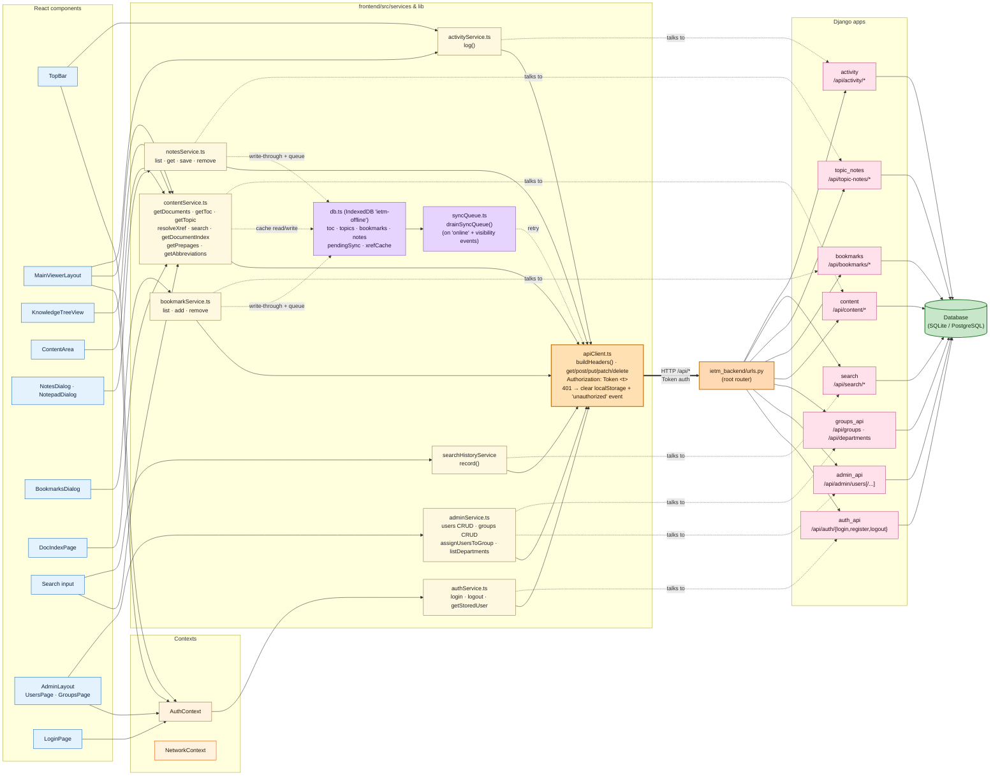
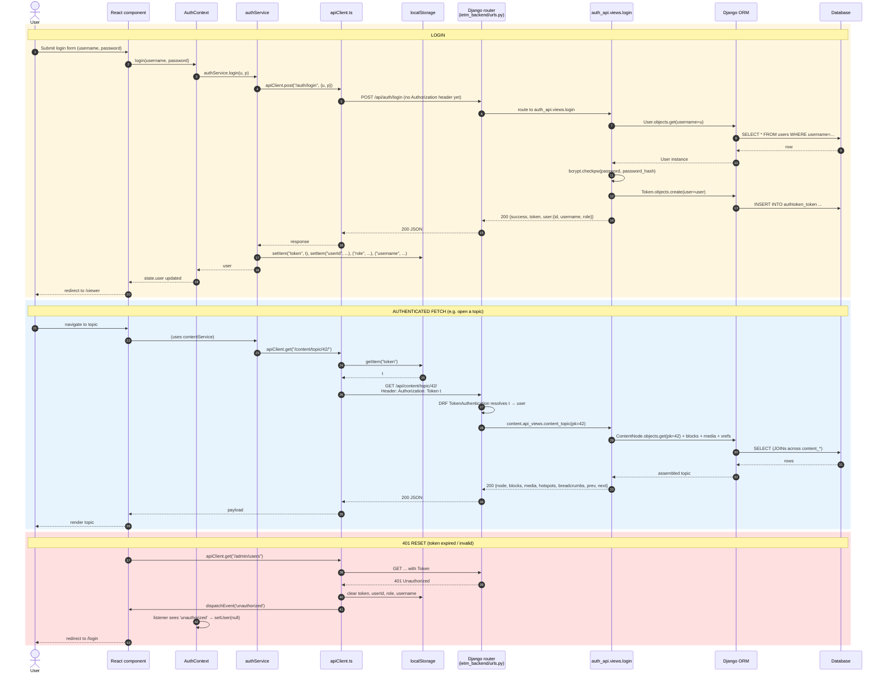

# API Flow — Frontend ↔ Backend

How a request travels from a React component down to a database row, and back. Two diagrams:

1. **Service-to-app mapping** — flowchart showing every frontend service and the backend app it talks to.
2. **Auth & request sequence** — sequence diagram for login, an authenticated fetch, and the 401 reset.

---

## 1. Service-to-app mapping

### Service → app mapping (cheat sheet)

| Frontend service | Backend app | Notes |
|---|---|---|
| `authService.ts` | `auth_api` | Token-based; stores token in localStorage |
| `contentService.ts` | `content` | Reads cache from IndexedDB on network failure |
| `notesService.ts` | `topic_notes` | Confusingly named — talks to `/api/topic-notes/`, NOT the legacy `/api/notes/` |
| `bookmarkService.ts` | `bookmarks` | Offline write-through + queue |
| `adminService.ts` | `admin_api` + `groups_api` | Hits two apps via one service |
| `activityService.ts` | `activity` | Fire-and-forget |
| `searchHistoryService` | `search` | Fire-and-forget |

**Note:** The frontend service `notesService.ts` talks to `/api/topic-notes/` — the backend's `notes` app is legacy code with no current frontend consumer.

### Offline path

The offline branch (purple) is **only on writes** for `notesService.ts` and `bookmarkService.ts`:

1. User saves a note while offline → `notesService.save()` writes to `offlineDb` immediately.
2. On error, queues a `pendingSync` action.
3. When the browser fires `online` or the tab becomes visible, `syncQueue.drainSyncQueue()` replays the queue against `apiClient`.

Reads (admin, auth, etc.) **do not** use the offline cache — they fail with an error if the network is down.

---

## 2. Authenticated request lifecycle

---

## Key source files

| Layer | File | Lines |
|---|---|---|
| API client | [frontend/src/lib/apiClient.ts](../../frontend/src/lib/apiClient.ts) | 1–92 |
| Auth context | [frontend/src/context/AuthContext.tsx](../../frontend/src/context/AuthContext.tsx) | 22–63 |
| Offline DB | [frontend/src/lib/db.ts](../../frontend/src/lib/db.ts) | — |
| Sync queue | [frontend/src/lib/syncQueue.ts](../../frontend/src/lib/syncQueue.ts) | 40–43 |
| Services | [frontend/src/services/*.ts](../../frontend/src/services/) | — |
| Root router | [backend/ietm_backend/urls.py](../../backend/ietm_backend/urls.py) | 10–25 |
| Auth views | [backend/auth_api/views.py](../../backend/auth_api/views.py) | — |
| Content API views | [backend/content/api_views.py](../../backend/content/api_views.py) | — |
| Settings (REST_FRAMEWORK) | [backend/ietm_backend/settings.py](../../backend/ietm_backend/settings.py) | — |
