# Backend Architecture

Top-down map of the Django backend: how a request enters, which middleware it passes through, which app's router and view handle it, and which models / database tables it touches.

**Render this in any Mermaid viewer (GitHub renders it automatically; VS Code needs the "Markdown Preview Mermaid Support" extension; or paste into https://mermaid.live).**

```mermaid
flowchart TD
    %% ============ ENTRY ============
    manage["manage.py"]:::entry
    wsgi["wsgi.py / asgi.py"]:::entry
    settings["ietm_backend/settings.py<br/>INSTALLED_APPS · AUTH_USER_MODEL='auth_api.User'<br/>REST_FRAMEWORK · CORS · DB"]:::entry
    rootUrls["ietm_backend/urls.py<br/>(root router)"]:::router

    manage --> settings
    wsgi --> settings
    settings --> rootUrls

    %% ============ MIDDLEWARE STACK ============
    subgraph MW["Middleware (in order)"]
        direction TB
        m1["CorsMiddleware<br/>CORS_ALLOW_ALL_ORIGINS=True"]:::mw
        m2["WhiteNoiseMiddleware<br/>(standalone mode only)"]:::mw
        m3["SecurityMiddleware"]:::mw
        m4["SessionMiddleware"]:::mw
        m5["CommonMiddleware"]:::mw
        m6["CsrfViewMiddleware"]:::mw
        m7["AuthenticationMiddleware"]:::mw
        m8["XFrameOptionsMiddleware"]:::mw
        m1 --> m2 --> m3 --> m4 --> m5 --> m6 --> m7 --> m8
    end
    settings -. configures .-> MW
    MW -. intercepts every request .-> rootUrls

    %% ============ ROUTER FAN-OUT ============
    rootUrls --> r_auth["/api/auth/"]:::route
    rootUrls --> r_admin["/api/admin/"]:::route
    rootUrls --> r_content["/api/content/"]:::route
    rootUrls --> r_groups["/api/groups/"]:::route
    rootUrls --> r_dept["/api/departments"]:::route
    rootUrls --> r_book["/api/bookmarks/"]:::route
    rootUrls --> r_notes["/api/notes/"]:::route
    rootUrls --> r_tnotes["/api/topic-notes/"]:::route
    rootUrls --> r_search["/api/search/"]:::route
    rootUrls --> r_activity["/api/activity/"]:::route
    rootUrls --> r_misc["/api/printLogs<br/>/api/model-hotspots/&lt;name&gt;<br/>/api/image-hotspots/&lt;name&gt;<br/>/health · /dbtest · /protected"]:::route
    rootUrls --> r_spa["(.*) SPA fallback<br/>SERVE_SPA=1"]:::route
    rootUrls --> r_media["/media/"]:::route

    %% ============ AUTH APP ============
    subgraph A_AUTH["auth_api"]
        direction TB
        au_urls["urls.py<br/>login · register · logout"]:::file
        au_views["views.py<br/>login() · register() · logout()"]:::view
        au_auth["authentication.py<br/>CsrfExemptSessionAuthentication"]:::file
        au_perm["permissions.py<br/>IsAdminRole"]:::file
        au_backend["backends.py<br/>BcryptAuthBackend"]:::file
        au_utils["utils.py<br/>hash_password()"]:::file
        au_models["models.py<br/>User (AbstractBaseUser)<br/>UserManager"]:::model
        au_urls --> au_views
        au_views --> au_backend
        au_views --> au_models
        au_views -. uses .-> au_auth
        au_backend --> au_utils
    end
    r_auth --> au_urls

    %% ============ ADMIN APP ============
    subgraph A_ADMIN["admin_api (no models)"]
        direction TB
        ad_urls["urls.py<br/>users · users/&lt;id&gt; · users/&lt;id&gt;/status"]:::file
        ad_views["views.py<br/>users_list() · user_detail() · user_status()"]:::view
        ad_urls --> ad_views
    end
    r_admin --> ad_urls
    ad_views -. IsAdminRole .-> au_perm
    ad_views -. reads/writes .-> au_models

    %% ============ CONTENT APP ============
    subgraph A_CONTENT["content"]
        direction TB
        co_apiurls["api_urls.py<br/>documents/ · tree/&lt;doc_id&gt;/ · topic/&lt;pk&gt;/<br/>search/ · resolve-xref/ · document-index/&lt;doc_id&gt;/<br/>prepages/ · abbreviations/"]:::file
        co_urls["urls.py (HTML viewer, non-SPA mode)"]:::file
        co_adminurls["admin_urls.py (/admin-panel/)"]:::file
        co_apiviews["api_views.py<br/>content_documents · content_tree<br/>content_topic · content_search<br/>resolve_xref · document_index"]:::view
        co_vglobal["views_global.py<br/>prepages() · abbreviations()"]:::view
        co_aviews["admin_views.py (CRUD)"]:::view
        co_models["models.py<br/>Document · ContentNode · ContentBlock<br/>Media · Hotspot · MeshHotspot · CrossReference"]:::model
        co_apiurls --> co_apiviews
        co_apiurls --> co_vglobal
        co_adminurls --> co_aviews
        co_apiviews --> co_models
        co_vglobal --> co_models
        co_aviews --> co_models
    end
    r_content --> co_apiurls

    %% ============ GROUPS APP ============
    subgraph A_GROUPS["groups_api"]
        direction TB
        g_urls["urls.py<br/>'' · &lt;id&gt; · &lt;id&gt;/assign"]:::file
        g_urlsdept["urls_dept.py<br/>'' (list departments)"]:::file
        g_views["views.py<br/>groups_list · group_detail<br/>assign_users · get_departments"]:::view
        g_models["models.py<br/>Department · UserGroup · GroupUser"]:::model
        g_urls --> g_views
        g_urlsdept --> g_views
        g_views --> g_models
    end
    r_groups --> g_urls
    r_dept --> g_urlsdept
    g_models -. FK .-> au_models

    %% ============ PER-USER APPS ============
    subgraph A_BOOK["bookmarks"]
        direction TB
        b_urls["urls.py"]:::file --> b_views["views.py<br/>bookmarks_list · delete_bookmark"]:::view --> b_models["models.py<br/>Bookmark"]:::model
    end
    r_book --> b_urls

    subgraph A_NOTES["notes (legacy global)"]
        direction TB
        n_urls["urls.py"]:::file --> n_views["views.py<br/>save_note · note_detail<br/>delete_note_by_topic"]:::view --> n_models["models.py<br/>Note"]:::model
    end
    r_notes --> n_urls

    subgraph A_TNOTES["topic_notes (per-topic)"]
        direction TB
        tn_urls["urls.py"]:::file --> tn_views["views.py<br/>topic_notes_list · topic_note_detail"]:::view --> tn_models["models.py<br/>TopicNote (HARD FK→User)"]:::model
    end
    r_tnotes --> tn_urls
    tn_models -. FK .-> au_models

    subgraph A_SEARCH["search"]
        direction TB
        s_urls["urls.py"]:::file --> s_views["views.py<br/>add_search · get_recent_searches"]:::view --> s_models["models.py<br/>RecentSearch"]:::model
    end
    r_search --> s_urls

    subgraph A_ACT["activity"]
        direction TB
        ac_urls["urls.py"]:::file --> ac_views["views.py<br/>add_activity · get_activity"]:::view --> ac_models["models.py<br/>UserActivity"]:::model
    end
    r_activity --> ac_urls

    %% ============ MISC / SPA / MEDIA ============
    serve_spa["serve_spa.py<br/>serve_react()"]:::external
    static_dir[("static/frontend/<br/>index.html · assets/*<br/>(WhiteNoise)")]:::external
    media_dir[("media/<br/>MEDIA_ROOT")]:::external
    misc_views["ietm_backend/views.py<br/>health · dbtest · protected<br/>print_logs · model_hotspots · image_hotspots"]:::view

    r_misc --> misc_views
    r_spa --> serve_spa --> static_dir
    r_media --> media_dir
    misc_views -. reads .-> co_models

    %% ============ MANAGEMENT COMMANDS ============
    subgraph CMDS["Management Commands"]
        direction TB
        cmd_import["import_xml<br/>(parses master.xml → DB)"]:::cmd
        cmd_deploy["prepare_deployment<br/>(DOCX→XML→DB + build SPA + package)"]:::cmd
    end
    cmd_import --> co_models
    cmd_deploy --> cmd_import

    %% ============ DATABASE ============
    DB[("Database<br/>SQLite (standalone)<br/>PostgreSQL (network)")]:::db
    au_models --> DB
    g_models --> DB
    co_models --> DB
    b_models --> DB
    n_models --> DB
    tn_models --> DB
    s_models --> DB
    ac_models --> DB

    %% ============ STYLES ============
    classDef entry fill:#ffe4b5,stroke:#c97c1f,stroke-width:1px,color:#2e1a05
    classDef router fill:#ffd9b3,stroke:#c97c1f,stroke-width:2px,color:#2e1a05
    classDef route fill:#fff6e0,stroke:#c9a14f,stroke-width:1px,color:#3a2a06
    classDef view fill:#fff8e1,stroke:#8a7a3e,stroke-width:1px,color:#1f1f1f
    classDef model fill:#ffe1ec,stroke:#b8417c,stroke-width:1px,color:#2a0a18
    classDef file fill:#fff5da,stroke:#b59a55,stroke-width:1px,color:#241a05
    classDef mw fill:#e5e5e5,stroke:#888,stroke-width:1px,color:#222
    classDef cmd fill:#ffe6cc,stroke:#cc7a1f,stroke-width:1px,color:#2e1a05
    classDef external fill:#e6d4ff,stroke:#7b4cb0,stroke-width:1px,color:#1f0f3a
    classDef db fill:#c8e6c9,stroke:#2e7d32,stroke-width:2px,color:#0a2e0a
```

---

## Legend

| Color | Meaning |
|---|---|
| Orange (dark) | Entry points / config (`manage.py`, `settings.py`, `urls.py` router) |
| Cream/yellow (dark border) | URL prefixes from root router |
| Cream (lighter) | View functions / `urls.py` of each app |
| Pink | `models.py` (data layer of each app) |
| Gray | Middleware stack (applied to every request before routing) |
| Orange (light) | Management commands (CLI entry points, not HTTP) |
| Purple | External / static resources (SPA bundle, media uploads) |
| Green | Database (single sink for all models) |

---

## Routing summary

Every URL prefix below comes from [backend/ietm_backend/urls.py](../../backend/ietm_backend/urls.py).

| Prefix | App | Endpoints |
|---|---|---|
| `/api/auth/` | `auth_api` | `login`, `register`, `logout` |
| `/api/admin/` | `admin_api` | `users`, `users/<id>`, `users/<id>/status` |
| `/api/content/` | `content` | `documents/`, `tree/<doc_id>/`, `topic/<pk>/`, `search/`, `resolve-xref/`, `document-index/<doc_id>/`, `prepages/`, `abbreviations/` |
| `/api/groups/` | `groups_api` | `''`, `<id>`, `<id>/assign` |
| `/api/departments` | `groups_api` | `''` (uses **urls_dept.py**, separate module) |
| `/api/bookmarks/` | `bookmarks` | `''`, `<id>/` |
| `/api/notes/` | `notes` | `''`, `<userId>`, `<topicId>` |
| `/api/topic-notes/` | `topic_notes` | `''`, `<topicId>/` |
| `/api/search/` | `search` | `''`, `<userId>` |
| `/api/activity/` | `activity` | `''`, `<userId>` |
| `/api/printLogs`, `/api/model-hotspots/<n>`, `/api/image-hotspots/<n>`, `/health`, `/dbtest`, `/protected` | (project-level) | one-off endpoints in `ietm_backend/views.py` |
| `/(.*)` (when `SERVE_SPA=1`) | — | falls through to `serve_spa.py` → React `index.html` |
| `/media/` | — | static media files via `django.conf.urls.static` |

## Deployment modes

Switched by the `IETM_MODE` env var (see [settings.py](../../backend/ietm_backend/settings.py)):

- **`standalone`** — SQLite DB, WhiteNoise serves the React SPA from `static/frontend/`, all in one Django process.
- **`network`** — PostgreSQL DB, Nginx (external) serves static assets, Django serves only the API + `/admin-panel/`.

The `SERVE_SPA=1` env var independently controls whether the SPA fallback route is registered.
