```mermaid
flowchart TD
    %% ============ XML SOURCES ============
    subgraph SRC["XML sources (input)"]
        direction TB
        xml1["master.xml<br/>(authored technical manual)"]:::xml
        xml2["ietm_output.xml<br/>(pipeline-converted from DOCX)"]:::xml
        media_src[("Source media<br/>(images, GLB, MP4, PDF)")]:::xml
    end

    %% ============ IMPORT PIPELINE ============
    cmd_pipeline["manage.py prepare_deployment<br/>(orchestrates phase 1+2)"]:::cmd
    cmd_import["manage.py import_xml<br/>(content/management/commands/import_xml.py)"]:::cmd
    media_root[("media/<br/>MEDIA_ROOT")]:::storage

    xml1 --> cmd_import
    xml2 --> cmd_import
    media_src --> cmd_pipeline
    cmd_pipeline --> cmd_import
    cmd_pipeline --> media_root

    %% ============ DATABASE TABLES ============
    subgraph DB_CONTENT["Database — content domain"]
        direction TB
        t_doc[("content_document<br/>doc_id, title, doc_type<br/>classification, generated_date")]:::table
        t_node[("content_node<br/>node_type, xml_id, number, title<br/>level, parent_id, path, order<br/>leaf_group_root_id")]:::table
        t_block[("content_block<br/>node_id, block_type, order<br/>content_html, raw_data (JSON)")]:::table
        t_media[("content_media<br/>block_id, document_id<br/>media_type, file_path, xml_id<br/>width, height, format")]:::table
        t_hot[("content_hotspot<br/>media_id, x, y, w, h<br/>target_node_id, target_xml_id, label")]:::table
        t_mesh[("content_mesh_hotspot<br/>media_id, mesh_name<br/>target_node_id, text")]:::table
        t_xref[("content_crossreference<br/>source_block_id, ref_type<br/>display_text, target_xml_id<br/>target_node_id, target_media_id")]:::table

        t_doc -->|"1 : N"| t_node
        t_node -->|"self<br/>parent / leaf_group_root"| t_node
        t_node -->|"1 : N"| t_block
        t_doc -->|"1 : N"| t_media
        t_block -->|"1 : N (nullable)"| t_media
        t_media -->|"1 : N"| t_hot
        t_media -->|"1 : N"| t_mesh
        t_node -.->|"target (SET_NULL)"| t_hot
        t_node -.->|"target (SET_NULL)"| t_mesh
        t_block -->|"source"| t_xref
        t_node -.->|"target (SET_NULL)"| t_xref
        t_media -.->|"target (SET_NULL)"| t_xref
    end

    cmd_import --> t_doc
    cmd_import --> t_node
    cmd_import --> t_block
    cmd_import --> t_media
    cmd_import --> t_hot
    cmd_import --> t_mesh
    cmd_import --> t_xref
    cmd_import -. copies files .-> media_root

    %% ============ API ENDPOINTS ============
    subgraph API["Content API (content/api_urls.py)"]
        direction TB
        e_docs["GET /api/content/documents/<br/>→ content_documents()"]:::api
        e_tree["GET /api/content/tree/&lt;doc_id&gt;/<br/>→ content_tree()"]:::api
        e_topic["GET /api/content/topic/&lt;pk&gt;/<br/>→ content_topic()"]:::api
        e_search["GET /api/content/search/?q=<br/>→ content_search()"]:::api
        e_xref["GET /api/content/resolve-xref/?xml_id=<br/>→ resolve_xref()"]:::api
        e_idx["GET /api/content/document-index/&lt;doc_id&gt;/<br/>→ document_index()"]:::api
        e_pre["GET /api/content/prepages/<br/>→ views_global.prepages()"]:::api
        e_abbr["GET /api/content/abbreviations/<br/>→ views_global.abbreviations()"]:::api
    end

    e_docs --> t_doc
    e_tree --> t_node
    e_tree --> t_doc
    e_topic --> t_node
    e_topic --> t_block
    e_topic --> t_media
    e_topic --> t_hot
    e_topic --> t_mesh
    e_topic --> t_xref
    e_search --> t_block
    e_search --> t_node
    e_xref --> t_xref
    e_xref --> t_node
    e_xref --> t_media
    e_idx --> t_node
    e_idx --> t_doc
    e_pre --> media_root
    e_abbr --> t_block

    %% ============ FRONTEND CONSUMERS ============
    subgraph FE["Frontend consumers (via contentService.ts)"]
        direction TB
        fe_main["MainViewerLayout"]:::ui
        fe_tree["KnowledgeTreeView<br/>TreeNode · TreeConnectors · TreeCanvas"]:::ui
        fe_area["ContentArea"]:::ui
        fe_model["ModelViewer3D"]:::ui
        fe_img["ImageWithFallback"]:::ui
        fe_doc["DocIndexPage"]:::ui
        fe_pre["PrepagesView"]:::ui
        fe_abbr["AbbrevDialog"]:::ui
        fe_media["MediaFullscreen"]:::ui
    end

    e_docs --> fe_main
    e_tree --> fe_tree
    e_topic --> fe_area
    e_topic --> fe_model
    e_topic --> fe_img
    e_topic --> fe_media
    e_search --> fe_main
    e_xref --> fe_area
    e_idx --> fe_doc
    e_pre --> fe_pre
    e_abbr --> fe_abbr

    %% ============ HOTSPOT INTERACTION ============
    fe_img -.->|"click hotspot → target_node_id"| fe_area
    fe_model -.->|"click mesh hotspot → target_node_id"| fe_area
    fe_area -.->|"click xref → resolve-xref"| e_xref

    %% ============ STYLES ============
    classDef xml fill:#d0e8ff,stroke:#1565c0,stroke-width:1px,color:#0a1e3a
    classDef cmd fill:#ffe6cc,stroke:#cc7a1f,stroke-width:1px,color:#2e1a05
    classDef table fill:#ffe1ec,stroke:#b8417c,stroke-width:1px,color:#2a0a18
    classDef api fill:#fff8e1,stroke:#8a7a3e,stroke-width:1px,color:#1f1f1f
    classDef ui fill:#e3f2fd,stroke:#1565c0,stroke-width:1px,color:#0a1e3a
    classDef storage fill:#e6d4ff,stroke:#7b4cb0,stroke-width:1px,color:#1f0f3a
```

# Content Domain (zoom-in)

The content domain is the heart of the IETM viewer: an XML technical manual is parsed into a hierarchical tree of nodes, blocks, media, and hotspots — then served to the React SPA through 8 API endpoints.

This diagram zooms in on just that subgraph: **XML source → import command → DB tables → API endpoints → frontend consumers**.

---

---

## How the tree is built

1. **`manage.py prepare_deployment`** orchestrates the whole pipeline:
   - Phase 1 — DOCX → XML conversion (via `pipeline_updated` module).
   - Phase 2 — `import_xml` parses the XML, then the React SPA is built and packaged.

2. **`manage.py import_xml`** (the parser) walks the XML and writes rows in this order:
   1. `content_document` — one row per manual.
   2. `content_node` — recursive walk; each `<sect>` / `<leaf>` becomes a node. `parent_id` and `path` (materialized path like `1.2.3`) are filled as the tree is descended; sibling `order` is the document order.
   3. `content_block` — each `<para>`, `<list>`, `<figure>`, `<table>`, `<model3d>`, `<video>`, `<pdf>` inside a node becomes a block. `content_html` is pre-rendered; `raw_data` holds structured data (e.g. CALS table cells).
   4. `content_media` — for every `<figure>` / 3D / video / PDF block, copy the source file to `MEDIA_ROOT` and write a Media row.
   5. `content_hotspot` — for `<hotspot>` elements inside images, save coords + `target_xml_id` (resolved to `target_node_id` in a second pass).
   6. `content_mesh_hotspot` — for `<mesh-hotspot>` on 3D models, save `mesh_name` + target.
   7. `content_crossreference` — for every `<xref>` inside a block, save source/target ids. Targets are resolved in a final pass once all nodes/media exist.

3. **Two-pass resolution.** Hotspots and cross-references store both `target_xml_id` (the raw ID from XML) **and** `target_node_id` / `target_media_id` (resolved FK). The raw ID is the fallback when the target hasn't been parsed yet, or for runtime resolution via `/api/content/resolve-xref/`.

---

## How a topic is served

`GET /api/content/topic/<pk>/` is the most complex endpoint. Given a node pk, [content/api_views.py](../../backend/content/api_views.py)'s `content_topic` returns:

- The `ContentNode` itself (title, number, level).
- All `ContentBlock`s ordered by `order`, with `content_html` ready to inject into the DOM.
- All `Media` referenced by those blocks (with `file_path` so the frontend can `` it).
- For each Media: its `Hotspot`s and `MeshHotspot`s.
- All `CrossReference`s sourced from those blocks (so `<xref>` clicks resolve client-side).
- **Breadcrumbs** — walked from `parent_id` up to the document root using the `path` field.
- **prev / next** — the sibling nodes (by `parent_id` + `order`) for next/previous navigation.

This is why a single topic fetch returns a payload that touches **all seven** content tables in one query plan.

---

## Key source files

| Concern | File |
|---|---|
| Models (all tables in this diagram) | [backend/content/models.py](../../backend/content/models.py) |
| API endpoints | [backend/content/api_views.py](../../backend/content/api_views.py) |
| Global endpoints (prepages, abbreviations) | [backend/content/views_global.py](../../backend/content/views_global.py) |
| URL routing | [backend/content/api_urls.py](../../backend/content/api_urls.py) |
| XML importer | [backend/content/management/commands/import_xml.py](../../backend/content/management/commands/import_xml.py) |
| Deployment pipeline | [backend/content/management/commands/prepare_deployment.py](../../backend/content/management/commands/prepare_deployment.py) |
| Frontend service | [frontend/src/services/contentService.ts](../../frontend/src/services/contentService.ts) |
| Tree renderer | [frontend/src/app/components/KnowledgeTreeView/](../../frontend/src/app/components/) |
