# Database Schema (ER Diagram)

Full entity-relationship diagram of every table in the IETM database, with all columns and types. Generated from each app's `models.py` and verified against [backend/DB_structure.txt](../../backend/DB_structure.txt).

**Storage:** SQLite (`backend/db.sqlite3`) in standalone mode, PostgreSQL in network mode. Most tables are `managed=False` — schema is created by raw-SQL migrations (e.g. [auth_api/migrations/0003_create_users_table.py](../../backend/auth_api/migrations/0003_create_users_table.py)).

---

## ER Diagram

```mermaid
erDiagram
    %% ============ AUTH / GROUPS DOMAIN ============
    users {
        int id PK
        string username UK "max=255, unique"
        string password "db_column=password_hash, max=255"
        string role "default='viewer' (admin|viewer)"
        string department "nullable"
        bool is_active "default=True"
    }

    departments {
        int id PK
        string name "max=255"
    }

    groups {
        int id PK
        string name "max=255"
        text description "nullable"
        string shared_username "nullable"
        string shared_password_hash "nullable"
        int department_id FK "nullable, on_delete=CASCADE"
    }

    group_users {
        int id PK
        int group_id FK "on_delete=CASCADE"
        int user_id FK "on_delete=CASCADE"
    }

    %% ============ CONTENT DOMAIN ============
    content_document {
        int id PK
        string doc_id UK "max=100, indexed"
        string title "max=500"
        string doc_type "default='Technical Manual'"
        string classification "default='UNCLASSIFIED'"
        date generated_date "nullable"
        string generator_version "default='1.0'"
        datetime imported_at "auto_now_add"
    }

    content_node {
        int id PK
        int document_id FK "on_delete=CASCADE"
        string node_type "section|leaf_group|leaf"
        string xml_id "indexed, e.g. CALM_DS_sec_1_2_3"
        string number "dotted, e.g. 1.2.3"
        string title "max=500"
        int level "1-6, default=1"
        int parent_id FK "self, nullable, on_delete=CASCADE"
        string path "materialized, indexed"
        int order "default=0"
        int leaf_group_root_id FK "self, nullable, on_delete=SET_NULL"
    }

    content_block {
        int id PK
        int node_id FK "on_delete=CASCADE"
        string block_type "para|list|figure|table|model3d|video|pdf"
        int order "document order within node"
        text content_html "pre-rendered HTML"
        json raw_data "nullable, structured CALS/list/figure"
    }

    content_media {
        int id PK
        int block_id FK "nullable, on_delete=CASCADE"
        int document_id FK "on_delete=CASCADE"
        string media_type "image|3d_model|video|pdf"
        string file_path "relative to MEDIA_ROOT"
        string original_filename
        string xml_id "indexed, e.g. fig-1.1"
        string number "figure/table number"
        string title
        int width "nullable"
        int height "nullable"
        string format "png|jpeg|gif|webp"
    }

    content_hotspot {
        int id PK
        int media_id FK "on_delete=CASCADE"
        int x
        int y
        int width
        int height
        int target_node_id FK "nullable, on_delete=SET_NULL"
        string target_xml_id "fallback for resolution"
        string label
    }

    content_mesh_hotspot {
        int id PK
        int media_id FK "on_delete=CASCADE"
        string mesh_name "mesh name in GLB"
        int target_node_id FK "nullable, on_delete=SET_NULL"
        string target_xml_id
        string text "display label"
    }

    content_crossreference {
        int id PK
        int source_block_id FK "on_delete=CASCADE"
        string ref_type "figure|table|section"
        string display_text "e.g. Figure 1.1"
        string target_xml_id "indexed"
        int target_node_id FK "nullable, on_delete=SET_NULL"
        int target_media_id FK "nullable, on_delete=SET_NULL"
    }

    %% ============ PER-USER DATA (soft FK to users.id) ============
    bookmarks {
        int id PK
        int user_id "logical FK to users.id (no constraint)"
        string topic_title "max=255"
        string topic_path "max=255"
        datetime created_at "nullable"
    }

    notes {
        int id PK
        int user_id "logical FK to users.id (no constraint)"
        text content
        datetime updated_at
    }

    topic_notes {
        int id PK
        text topic_id
        int user_id FK "HARD FK to users.id, on_delete=CASCADE"
        text content "default=''"
        datetime updated_at "auto_now"
    }

    recent_searches {
        int id PK
        int user_id "logical FK to users.id (no constraint)"
        string term "max=255"
        datetime at
    }

    user_activity {
        int id PK
        int user_id "logical FK to users.id (no constraint)"
        string action "max=255"
        text details
        datetime at
    }

    %% ============ RELATIONSHIPS ============
    %% Auth / Groups
    users         ||--o{ group_users        : "is member of"
    groups        ||--o{ group_users        : "has member"
    departments   ||--o{ groups             : "owns (nullable)"

    %% Content tree
    content_document ||--o{ content_node           : "has nodes"
    content_node     ||--o{ content_node           : "parent → children"
    content_node     ||--o{ content_node           : "leaf_group_root → members"
    content_node     ||--o{ content_block          : "contains"
    content_document ||--o{ content_media          : "has media"
    content_block    ||--o{ content_media          : "renders (nullable)"
    content_media    ||--o{ content_hotspot        : "has hotspots"
    content_media    ||--o{ content_mesh_hotspot   : "has 3D hotspots"
    content_node     ||--o{ content_hotspot        : "is target of"
    content_node     ||--o{ content_mesh_hotspot   : "is target of"
    content_block    ||--o{ content_crossreference : "is source of"
    content_node     ||--o{ content_crossreference : "is target of (nullable)"
    content_media    ||--o{ content_crossreference : "is target of (nullable)"

    %% Hard FK from per-user data
    users ||--o{ topic_notes : "owns"
```

---

## Soft foreign keys (Mermaid can't draw these as dashed, so noted here)

These four tables store a plain `IntegerField user_id` referencing `users.id` **without a database constraint** — Django doesn't enforce it, the SQL schema has no `FOREIGN KEY` clause. Cleanup of orphaned rows on user delete must be done at the application layer (or by a cron job).

| Table | Owning app | Why soft FK? |
|---|---|---|
| `bookmarks` | `bookmarks` | Pre-dates the User model finalization; tolerated for read-mostly use. |
| `notes` | `notes` (legacy) | Same as above. **Note:** `topic_notes` is the newer/preferred per-topic store and **does** use a hard FK. |
| `recent_searches` | `search` | Append-only log; orphan rows don't break anything. |
| `user_activity` | `activity` | Audit log; orphan rows preserve history even after user deletion. |

The only per-user table with a real DB-level FK is `topic_notes` (cascade on user delete).

---

## Indexes & constraints

| Table | Indexes | Unique constraints |
|---|---|---|
| `users` | — | `username` |
| `groups` | — | — |
| `group_users` | — | `(group_id, user_id)` |
| `content_document` | `doc_id` | `doc_id` |
| `content_node` | `(document_id, path)`, `(document_id, xml_id)`, `(parent_id, order)`, `xml_id`, `path` | `(document_id, xml_id)` |
| `content_block` | `(node_id, order)` | — |
| `content_media` | `(document_id, xml_id)`, `xml_id` | — |
| `content_crossreference` | `target_xml_id` | — |
| `topic_notes` | `user_id`, `topic_id` (from raw SQL) | `(topic_id, user_id)` |

---

## Domain grouping (for understanding)

- **Auth & access:** `users`, `departments`, `groups`, `group_users`
- **Content corpus** (the IETM document): `content_document`, `content_node`, `content_block`, `content_media`, `content_hotspot`, `content_mesh_hotspot`, `content_crossreference` — populated by `manage.py import_xml`
- **Per-user state:** `bookmarks`, `notes`, `topic_notes`, `recent_searches`, `user_activity`

The content domain is the heart of the application — see [content-tree.md](./content-tree.md) for a focused view of just that subgraph.
